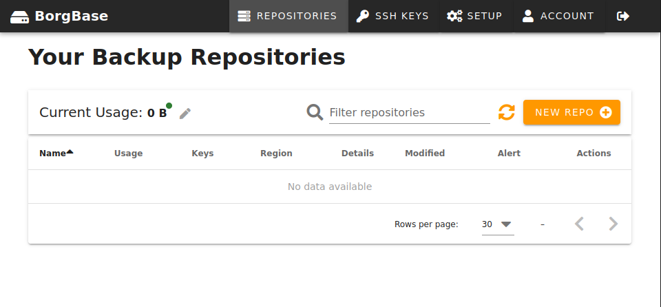
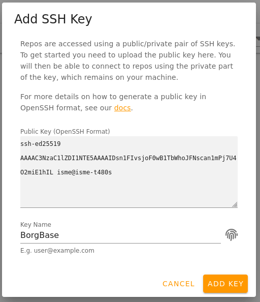
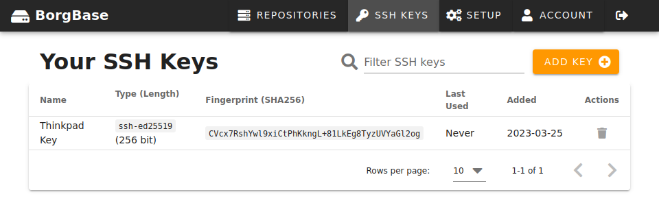
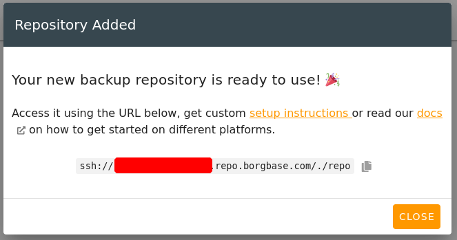
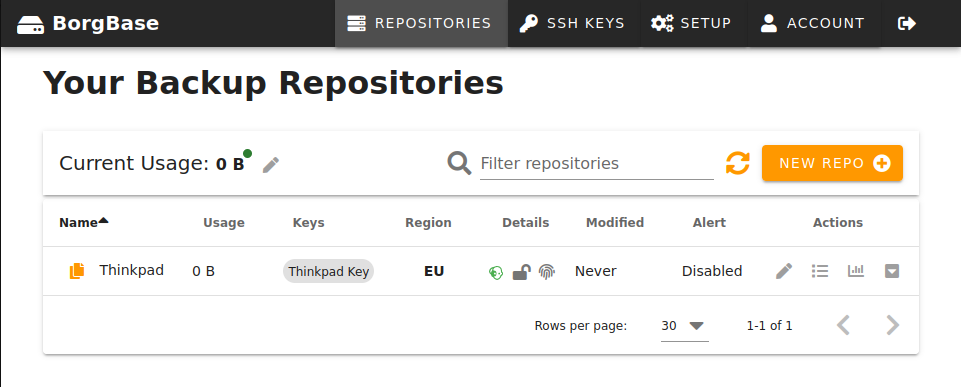
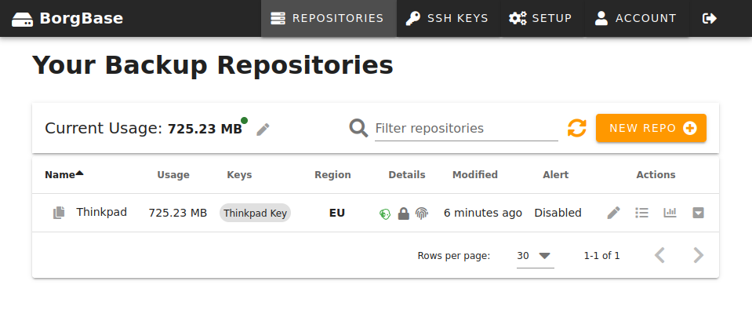
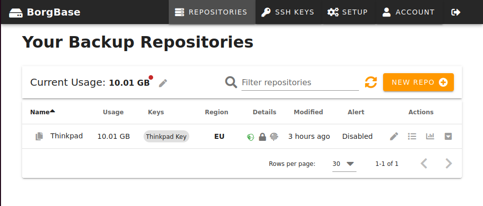
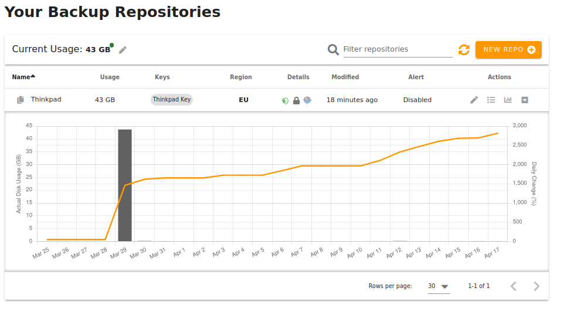

# BorgBase

## 2023-02-27

### Sign up

Sign up for BorgBase.

I already have a BorgBase login (created 2022-04-27!).

The account with my normal isn't active, and I didn't receive the activation mail or the password reset after 10 minutes, so I created a new account with `+borgbase` email syntax.

No payment details required for sign up. Good for low-risk testing.

## 2023-03-25

### Check email

It's been almost a month since I created the account without doing anything. On 2023-03-20 BorgBase support sent me a friendly email to remind me to set up a backup plan!

### Set up Borg Backups from the CLI

BorgBase first run looks like this:



BorgBase has an [API](https://docs.borgbase.com/api/), but it uses GraphQL and has no documentation that I can find. So I'll ignore that for now.

Read [How to Set Up Borg Backups from the Command Line on Linux and macOS](https://docs.borgbase.com/setup/borg/cli/).

Start a local terminal session.

Check the version of borg that I already have installed.

```console
$ borg --version
borg 1.2.4
```

Install Borgmatic.

```console
$ pipx install borgmatic
  installed package borgmatic 1.7.9, installed using Python 3.8.10
  These apps are now globally available
    - borgmatic
    - generate-borgmatic-config
    - upgrade-borgmatic-config
    - validate-borgmatic-config
done! ✨ 🌟 ✨
```

Generate a public-private key pair.

```console
$ ssh-keygen -o -a 100 -t ed25519
Generating public/private ed25519 key pair.
Enter file in which to save the key (/home/isme/.ssh/id_ed25519): /home/isme/.ssh/borgbase    
Enter passphrase (empty for no passphrase): 
Enter same passphrase again: 
Your identification has been saved in /home/isme/.ssh/borgbase
Your public key has been saved in /home/isme/.ssh/borgbase.pub
The key fingerprint is:
SHA256:CVcx7RshYwl9xiCtPhKkngL+81LkEg8TyzUVYaGl2og isme@isme-t480s
The key's randomart image is:
+--[ED25519 256]--+
|      .B*+=*     |
|   . o*  oB.*    |
|  . +=o .o * .   |
|. .*=..o..  o    |
|.E +Bo oS    o   |
| ...o+. o   .    |
|  ..o  . .       |
|   +             |
|    +.           |
+----[SHA256]-----+
```

Copy the public key.

```console
$ cat ~/.ssh/borgbase.pub | copy
```

Go to the BorgBase browser tab.

Click "SSH Keys" from the top menu.

Paste the key into the "Public Key" text area. Call the key "BorgBase".



Click "Add Key".

See the BorgBase key in the key list.



Click Repositories in the top menu.

Click "New Repo".

Use these settings:

* Basics: Repository Name: Thinkpad
* Basics: Repo Region: EU
* Basics: Repo Format: Borg
* Access: Full Access: Thinkpad Key
* Access: Append-Only Access: Leave blank
* Monitoring: Disable Alerts
* Compaction: Enable server-side compaction: disabled
* Advanced: Enable SFTP access: disabled

Click "Add Repository".

Create a new entry in 1Password for the repo called "BorgBase Thinkpad".

Add the repository name to the 1Password entry.



Click Close.

See an empty repo in the repo list.



Go to the terminal session.

Copy the repository name from 1Password and paste it at the following `read` prompt.

```bash
read -rs BORG_REPO
export BORG_REPO
```

Initialize the Borg repository.

```console
$ borg init --encryption repokey-blake2
The authenticity of host 'aaaaaaaa.repo.borgbase.com (11.11.11.11)' can't be established.
ECDSA key fingerprint is SHA256:aaaaaaaaaaaaaaaaaaaaaaaaaaaaaaaaaaaaaaaaaaa.
Are you sure you want to continue connecting (yes/no/[fingerprint])? yes
Remote: Warning: Permanently added 'aaaaaaaa.repo.borgbase.com,11.11.11.11' (ECDSA) to the list of known hosts.
Enter new passphrase: 
Enter same passphrase again: 
Do you want your passphrase to be displayed for verification? [yN]: N

By default repositories initialized with this version will produce security
errors if written to with an older version (up to and including Borg 1.0.8).

If you want to use these older versions, you can disable the check by running:
borg upgrade --disable-tam ssh://aaaaaaaa@aaaaaaaa.repo.borgbase.com/./repo

See https://borgbackup.readthedocs.io/en/stable/changes.html#pre-1-0-9-manifest-spoofing-vulnerability for details about the security implications.

IMPORTANT: you will need both KEY AND PASSPHRASE to access this repo!
If you used a repokey mode, the key is stored in the repo, but you should back it up separately.
Use "borg key export" to export the key, optionally in printable format.
Write down the passphrase. Store both at safe place(s).
```

Add to the 1Password entry the server's ECDSA key fingerprint and the repo private key.

Choose some test files to add to a test archive. I choose my downloads folder "descargas" in Spanish.

It has 701M of data and has 156 files.

```console
$ du -sh ~/Descargas
701M	/home/isme/Descargas
$ find ~/Descargas | wc --lines
156
```

Create a new test archive and add the test files.

```console
$ borg create ::test-archive-1 ~/Descargas
Enter passphrase for key ssh://aaaaaaaa@aaaaaaaa.repo.borgbase.com/./repo: 
```

It takes a few seconds to complete.

The guide suggests a hostname-timestamp naming convention for real repos, e.g. `thinkpad-2023-03-25`. Each archive is a versioned snapshot.

The next part of the guide shows how to automate archive creation with Borgmatic. Before doing that, check the BorgBase interface.

Go to the BorgBase browser tab.

See the updated repo status.



The Thinkpad repo shows the following changes:

* Usage: 725.23 MB
* Modified: 6 minutes ago

Click the menu symbol in the Thinkpad repo row to open the Event Log.

It shows the following events. `22.22.22.*` is my masked IP address.

|Datetime           |Event |IP        |SSH Key     |Details                    |
|-------------------|------|----------|------------|---------------------------|
|2023-03-25 11:13:53|logout|22.22.22.*|            |Change: 725MB              |
|2023-03-25 11:13:01|login |22.22.22.*|Thinkpad Key|Host: box-eu20.borgbase.com|
|2023-03-25 11:00:23|logout|22.22.22.*|            |Change: 0MB                |
|2023-03-25 10:58:58|login |22.22.22.*|Thinkpad Key|Host: box-eu20.borgbase.com|
|2023-03-25 02:37:17|create|          |            |                           |

Check the bar chart symbol in the row to open Usage.

It shows "Not enough data". Perhaps later it will show statistics over time.

The interface doesn't show the archives. I think BorgBase doesn't have access to those because only I have my password to unencrypt the details.

Go to the terminal session.

Use Borg to list the archives.

```console
$ borg list
Enter passphrase for key ssh://aaaaaaaa@aaaaaaaa.repo.borgbase.com/./repo: 
test-archive-1                       Sat, 2023-03-25 11:13:15 [a9807aac6c843e1de7c7cb1502bf699df5d77761a4639cd98dacd239d667f6c8]
```

Use Borg to list the files in the archive. Summarize the results with DuckDB. Omit the password prompt from the output.

```bash
borg list --json-lines -- ::test-archive-1 \
| duckdb -markdown -c "
  SELECT
    ROUND(SUM(size) / (1024 * 1024)) AS size_MB,
    COUNT(*) AS count
  FROM read_json_auto('/dev/stdin');
"
```

The size and the count roughly match! This is good enough for now, but later I'll check why there is a slight count difference.

| size_MB | count |
|---------|-------|
| 701.0   | 155   |

## 2023-03-27

### Compare the archive to the source

Why is there a slight count difference between local and archive storage?

This way of counting files has a problem.

```console
$ find ~/Descargas | wc --lines
156
```

One file name is not strictly one line. File names can contain newline characters.

I get a different result when I use null-terminated file names and then count the null bytes.

```console
$ find ~/Descargas -print0 | tr -d -c '\0' | wc -c
155
```

One of the file names has a newline. When printed directly to the terminal the newline is rendered as a question mark!

```console
$ find ~/Descargas -name $'*\n*'
/home/isme/Descargas/folder1/folder2/FILE NAME WITH SPACES?AND A NEW LINE.pdf
```

When piped to another process, the newline is preserved.

```console
$ find ~/Descargas -name $'*\n*' | cat
/home/isme/Descargas/folder1/folder2/FILE NAME WITH SPACES
AND A NEW LINE.pdf
```

Rather than parsing the names to derive a count, I can use the `du --inodes` to count the filesystem entries directly.

```console
$ du --summarize --inodes ~/Descargas | cut --fields 1
155
```

Do the byte counts match exactly? Almost, but not quite.

```console
$ du --summarize --bytes ~/Descargas | cut --fields 1
734618456
```

```console
$  cat /tmp/archive-list.jsonl | jq -n '[inputs | .size] | add'
734573400
```

I'm not sure why that is, but I'm not going to spend more time on it now.

## 2023-03-28

### Set up Borgmatic

Read the [Set up Borgmatic](https://docs.borgbase.com/setup/borg/cli/#step-6--set-up-borgmatic-for-regular-backups) section of the setup guide.

Read the official [Borgmatic documentation](https://torsion.org/borgmatic/).

Read [How to set up backups](https://torsion.org/borgmatic/docs/how-to/set-up-backups/) in the official Borgmatic documentation.

BorgBase and Borgmatic show different ways to install Borgmatic.

* `sudo pip3 install` - global system package
* `pip3 install --user` - user package
* `sudo pip3 install --user` root user package

If you need to back up system files that require privileged access, install as a global system package or as a root user package. If need only to back up user files, install as a normal user.

Use the global system package you have a relatively dedicated system and don't need to worry about library conflicts with other parts of the system Python. This is the simplest way to install Borgmatic but the least flexible.

Use the root user package for better isolation from the system Python's libraries. You may need to configure the `PATH` environment variable or sudo's `secure_path` option to make this work for all users.

Use the user package if you need only to back up user files. This is my use case.

A fourth option that I haven't seen documented in the other sources:

* `pipx install` - user virtualenv

Pipx installs the Python application in its own virtualenv to isolate it from any other Python libraries that I may have installed as a user. This is the method that I will use.

Borgmatic is available in the official Ubuntu 20.04 repository, but it's an old version: `1.5.1` compared to `1.7.10`.

Watch the [Asciinema screencast](https://asciinema.org/a/203761?autoplay=1). It shows how to use `generate-borgmatic-config` to get started. This is the method I will use.

The generator by default would write to `/etc`.

```console
$ generate-borgmatic-config --help
usage: generate-borgmatic-config [-h] [-s SOURCE_FILENAME] [-d DESTINATION_FILENAME] [--overwrite]

Generate a sample borgmatic YAML configuration file.

optional arguments:
  -h, --help            show this help message and exit
  -s SOURCE_FILENAME, --source SOURCE_FILENAME
                        Optional YAML configuration file to merge into the generated configuration,
                        useful for upgrading your configuration
  -d DESTINATION_FILENAME, --destination DESTINATION_FILENAME
                        Destination YAML configuration file, default: /etc/borgmatic/config.yaml
  --overwrite           Whether to overwrite any existing destination file, defaults to false
```

I don't want to configure Borgmatic system-wide. Where else does it look for configuration?

Check `borgmatic --help`:

```text
  -c [CONFIG_PATHS [CONFIG_PATHS ...]], --config [CONFIG_PATHS [CONFIG_PATHS ...]]
                        Configuration filenames or directories, defaults to: /etc/borgmatic/config.yaml
                        /etc/borgmatic.d $HOME/.config/borgmatic/config.yaml $HOME/.config/borgmatic.d
```

Borgmatic checks these paths for config:

* `/etc/borgmatic/config.yaml`
* `/etc/borgmatic.d`
* `$HOME/.config/borgmatic/config.yaml`
* `$HOME/.config/borgmatic.d`

I will use this path for my config: `$HOME/.config/borgmatic/config.yaml`.

Borgmatic automatically creates any missing folders in the path of the destination.

```console
$ generate-borgmatic-config --destination $HOME/.config/borgmatic/config.yaml
Generated a sample configuration file at /home/isme/.config/borgmatic/config.yaml.

This includes all available configuration options with example values. The few
required options are indicated. Please edit the file to suit your needs.

If you ever need help: https://torsion.org/borgmatic/#issues
```

Edit the file to set the following:

* source directories
* repositories
* storage encryption passphrase

I don't like having the password in plaintext in the file. Later I'll look for another way to do this more safely. See the [Borg Security FAQ](https://borgbackup.readthedocs.io/en/stable/faq.html#how-can-i-specify-the-encryption-passphrase-programmatically) for ways to set `BORG_PASSWORD` and `BORG_PASSCOMMAND` including a solution that works with Gnome Keychain.

Save the file and validate it.

```console
$ validate-borgmatic-config
All given configuration files are valid: /home/isme/.config/borgmatic/config.yaml
```

The generated config is mostly comments to explain all the possible options. How does it look without the comments?

Use `yq` to [strip all the comments](https://mikefarah.gitbook.io/yq/operators/comment-operators#remove-strip-all-comments).

```bash
yq '... comments=""' /home/isme/.config/borgmatic/config.yaml
```

The effective configuration looks like this:

```yaml
location:
  source_directories:
    - /home/isme/Descargas
  repositories:
    - path: ssh://aaaaaaaa@aaaaaaaa.repo.borgbase.com/./repo
      label: BorgBase
storage:
  encryption_passphrase: "..."
retention:
  keep_daily: 7
```

### Create a backup using Borgmatic

Borgmatic can create a repository using its `init` command, but I can skip that becuase I already created the repo using Borg.

Run Borgmatic and start a backup.

```console
$ borgmatic create --verbosity 1 --list --stats
ssh://aaaaaaaa@aaaaaaaa.repo.borgbase.com/./repo: Creating archive
Creating archive at "ssh://aaaaaaaa@aaaaaaaa.repo.borgbase.com/./repo::isme-t480s-2023-03-28T13:27:42.529490"
A /home/isme/Descargas/1679609313063.jpeg
Remote: Storage quota: 725.14 MB out of 10.00 GB used.
Remote: Storage quota: 725.14 MB out of 10.00 GB used.
------------------------------------------------------------------------------
Repository: ssh://aaaaaaaa@aaaaaaaa.repo.borgbase.com/./repo
Archive name: isme-t480s-2023-03-28T13:27:42.529490
Archive fingerprint: aaaaaaaaaaaaaaaaaaaaaaaaaaaaaaaaaaaaaaaaaaaaaaaaaaaaaaaaaaaaaaaa
Time (start): Tue, 2023-03-28 13:27:44
Time (end):   Tue, 2023-03-28 13:27:44
Duration: 0.06 seconds
Number of files: 146
Utilization of max. archive size: 0%
------------------------------------------------------------------------------
                       Original size      Compressed size    Deduplicated size
This archive:              734.57 MB            725.93 MB                639 B
All archives:                1.47 GB              1.45 GB            725.12 MB
                       Unique chunks         Total chunks
Chunk index:                     413                  836
------------------------------------------------------------------------------

summary:
/home/isme/.config/borgmatic/config.yaml: Successfully ran configuration file
```

The backup completes almost instantly. That's because the content of my Download folder has hardly changes. The line beginning `A` may indicate a new file path in the folder. The deduplicated size of the new archive is a mere 639 bytes.

The number of files is 146. This is less than what I counted earlier.

Investigate locally to clarify what's going on.

`du --summarize --inodes` counts 1 inode for each file and each directory including the root.

```console
$ du --summarize --inodes ~/Descargas/
155	/home/isme/Descargas/
```

`tree -a` gives a separate count for all the files and all the directories excluding the root. `146 + 8 = 154`.

```console
$ tree -a ~/Descargas/ | tail -1
8 directories, 146 files
```

Use Borg again to list what is in the new archive to check my understanding.

It still lists 155, which matches `du`.

```console
$ borg list --json-lines -- "::isme-t480s-2023-03-28T13:27:42.529490"  > /tmp/archive.jsonl
Enter passphrase for key ssh://aaaaaaaa@aaaaaaaa.repo.borgbase.com/./repo: 
$ cat /tmp/archive.jsonl | wc -l
155
```

`tree` and `du` have limited options for filtering what is counted. `find` can filter on almost any attribute of a file. It ocurred to me that I can just print a symbol and use `wc`'s character counting mode.

```console
$ find ! -type d -printf '.' | wc -c
146
$ find -type d -printf '.' | wc -c
9
```

I can find folders in the archive listing like this.

```console
$ cat /tmp/archive.jsonl | jq -n -c '[inputs | select(.type == "d")] | length'
9
```

### Create a backup of my home folder

Reconfigure Borgmatic to backup my entire home folder. It now looks like this:

```yaml
location:
  source_directories:
    - /home/isme
  repositories:
    - path: ssh://aaaaaaaa@aaaaaaaa.repo.borgbase.com/./repo
      label: BorgBase
storage:
  encryption_passphrase: "..."
retention:
  keep_daily: 7
```

Create a new backup with the following command.

```bash
borgmatic create --verbosity 1 --list --stats
```

This time it takes a long time to run. It prints an `A` line for every file it finds. There are more than one million files in my home folder, so this could take a while.

It fails suddenly with the following error:

```text
The storage quota (10.00 GB) has been exceeded (10.00 GB). Try deleting some archives.
```

There are no stats to tell me how long it took.

### Increase my quota on BorgBase



The BorgBase user interface shows that the Thinkpad repo has usage of 10.01 GB.

There is a red dot next to the total usage. A tooltip over the area shows:

> Your plan includes 10 GB with a flexible quota of up to 10 GB.

Click Account.

Click "Add or Extend Plan".

Choose the Small plan, which includes 250GB of storage for $24 per year.

Click Continue.

Complete the billing details and pay.

Get a billing confirmation.

>  Thank you for your order!

Click "Continue to Repos".

There is a green dot next to the total usage. A tooltip over the area shows:

> Your plan includes 250GB with a flexible quota of up to 1 TB.

Now I have a quota big enough to store all my files.

### Create a backup of my home folder again

Create the backup again, this time without the file list.

```bash
borgmatic create --verbosity 1 --stats
```

The output starts like this before pausing. It looks like The incomplete archive was discarded, because it looks like again I'm using just 725 MB of the remote storage cuota.

```text
ssh://aaaaaaaa@aaaaaaaa.repo.borgbase.com/./repo: Creating archive
Creating archive at "ssh://aaaaaaaa@aaaaaaaa.repo.borgbase.com/./repo::isme-t480s-2023-03-28T16:13:52.498386"
Remote: Storage quota: 725.14 MB out of 1.00 TB used.
```

This may take a while, so I leave it to run in the background.

### Check backup status

Complete output from Borgmatic.

```text
ssh://aaaaaaaa@aaaaaaaa.repo.borgbase.com/./repo: Creating archive
Creating archive at "ssh://aaaaaaaa@aaaaaaaa.repo.borgbase.com/./repo::isme-t480s-2023-03-28T16:13:52.498386"
Remote: Storage quota: 725.14 MB out of 1.00 TB used.
Remote: Storage quota: 18.86 GB out of 1.00 TB used.
Remote: Storage quota: 18.86 GB out of 1.00 TB used.
/home/isme/.aws/boto/cache/e047ea363e408c5ad38c5f366b22f6cbb080361a.json: open: [Errno 13] Permission denied: 'e047ea363e408c5ad38c5f366b22f6cbb080361a.json'
Remote: Storage quota: 21.81 GB out of 1.00 TB used.
------------------------------------------------------------------------------
Repository: ssh://aaaaaaaa@aaaaaaaa.repo.borgbase.com/./repo
Archive name: isme-t480s-2023-03-28T16:13:52.498386
Archive fingerprint: c5fa9e4e12ad701c4119cc8cb2398bf16519899195ccce449ef64cb24bc2aa0d
Time (start): Tue, 2023-03-28 16:13:54
Time (end):   Tue, 2023-03-28 16:52:18
Duration: 38 minutes 23.82 seconds
Number of files: 857154
Utilization of max. archive size: 0%
------------------------------------------------------------------------------
                       Original size      Compressed size    Deduplicated size
This archive:               41.90 GB             24.03 GB             21.06 GB
All archives:               43.37 GB             25.48 GB             21.78 GB
                       Unique chunks         Total chunks
Chunk index:                  643635               861313
------------------------------------------------------------------------------

summary:
/home/isme/.config/borgmatic/config.yaml: Successfully ran configuration file
```

It looks like one of the files failed to copy because of a permissions error. I get the same error when I try to read the file as my normal user. When I use `sudo` it works. I don't need the file anyway so I just delete it locally.

## 2023-03-29

### Automate the backups with a service

Read the the Borgmatic documentation's [Autopilot](https://torsion.org/borgmatic/docs/how-to/set-up-backups/#autopilot) section.

At this point I find the Borgmatic documentation easier to follow than the BorgBase documentation.

It shows how to configure a systemd service to run Borgmatic. It also notes that, depending on the installation method, this part may already be done for me. (Looking forward to upgrading to Ubuntu 22 to see whether that's true!)

Download the sample systemd file.

```bash
cdtemp
wget 'https://projects.torsion.org/borgmatic-collective/borgmatic/raw/branch/master/sample/systemd/borgmatic.service'
wget 'https://projects.torsion.org/borgmatic-collective/borgmatic/raw/branch/master/sample/systemd/borgmatic.timer'
```

Discover [Systemd Configurations Helper for Visual Studio Code](https://github.com/hangxingliu/vscode-systemd). It provides highlighting and documentation for the syntax. This is the first time I've read a systemd service file.

The only part I may want to change is the `Timer` configuration from daily to hourly. For now I will leave it as it is.

```systemd
[Timer]
OnCalendar=daily
Persistent=true
RandomizedDelaySec=3h
```

But wait. Can I event run this as a systemd service when it is installed as a user application?

### Learn how to configure a systemd user service

Google `systemd run user application as service`.

Read a variety of solutions:

* [How to run systemd service as specific user and group in Linux](https://www.golinuxcloud.com/run-systemd-service-specific-user-group-linux/)
* [How do I make my systemd service run via specific user and start on boot?](https://askubuntu.com/questions/676007/how-do-i-make-my-systemd-service-run-via-specific-user-and-start-on-boot)
* [Creating User’s Services With systemd](https://www.baeldung.com/linux/systemd-create-user-services)
* [Using systemd to Run Your App](http://perkframework.com/v1/guides/using-systemd-to-run-your-app.html)
* [Run any Executable as Systemd Service in Linux](https://blog.abhinandb.com/run-any-executable-as-systemd-service/)

All introduce the new syntax `WantedBy` but differ on the configured value. Not all of the solutions provide explanations for the value. 

* `default.target`
* `multi-user.target`

Read the [systemd.unit](https://www.freedesktop.org/software/systemd/man/systemd.unit.html) documentation.

> Units can be aliased (have an alternative name), by creating a symlink from the new name to the existing name in one of the unit search paths. For example, \[...\] `default.target` — the default system target started at boot — is commonly aliased to either `multi-user.target` or `graphical.target` to select what is started by default.

Read [Working with systemd targets](https://access.redhat.com/documentation/en-us/red_hat_enterprise_linux/8/html/configuring_basic_system_settings/working-with-systemd-targets_configuring-basic-system-settings) documentation.

> Targets in `systemd` act as synchronization points during the start of your system. Target unit files, which end with the `.target` file extension, represent the `systemd` targets. The purpose of target units is to group together various `systemd` units through a chain of dependencies.
>
> Consider the following examples:
>
> * The `graphical.target` unit for starting a graphical session starts system services such as the GNOME Display Manager (`gdm.service`) or Accounts Service (`accounts-daemon.service`), and also activates the `multi-user.target` unit.
> * Similarly, the `multi-user.target` unit starts other essential system services such as NetworkManager (`NetworkManager.service`) or D-Bus (`dbus.service`) and activates another target unit named `basic.target`.
> While working with `systemd` targets, you can view the default target, change it or change the current target. 

On my computer the default target is `graphical.target`.

```console
$ systemctl get-default
graphical.target
```

The above is also covered in the [systemd.special](https://www.freedesktop.org/software/systemd/man/systemd.special.html) documentation, but perhaps less clearly and harder to find.

Read more:

* [Why do most systemd examples contain WantedBy=multi-user.target?](https://unix.stackexchange.com/questions/506347/why-do-most-systemd-examples-contain-wantedby-multi-user-target)
* [Controlling Targets - runlevels with systemd](https://www.landoflinux.com/linux_runlevels_systemd.html)

Getting historical, the SysV runlevels correspond are mapped for compatibility to some the special targets in systemd.

```console
$ ls -l /lib/systemd/system/runlevel*.target
lrwxrwxrwx 1 root root 15 Mar  2 13:58 /lib/systemd/system/runlevel0.target -> poweroff.target
lrwxrwxrwx 1 root root 13 Mar  2 13:58 /lib/systemd/system/runlevel1.target -> rescue.target
lrwxrwxrwx 1 root root 17 Mar  2 13:58 /lib/systemd/system/runlevel2.target -> multi-user.target
lrwxrwxrwx 1 root root 17 Mar  2 13:58 /lib/systemd/system/runlevel3.target -> multi-user.target
lrwxrwxrwx 1 root root 17 Mar  2 13:58 /lib/systemd/system/runlevel4.target -> multi-user.target
lrwxrwxrwx 1 root root 16 Mar  2 13:58 /lib/systemd/system/runlevel5.target -> graphical.target
lrwxrwxrwx 1 root root 13 Mar  2 13:58 /lib/systemd/system/runlevel6.target -> reboot.target
```

That's enough digging into systemd.

For me it looks like the `default.target` is fine.

Make a copy of the original service file to make changes.

```bash
cp borgmatic.service my.borgmatic.service
```

So I add the following syntax to the `borgmatic.service` file.

```diff
--- borgmatic.service	2023-03-29 10:19:33.602654958 +0200
+++ my.borgmatic.service	2023-03-29 12:41:14.299500482 +0200
@@ -8,2 +8,5 @@
 
+[Install]
+WantedBy=default.target
+
 [Service]
```
There is already an "Install" section in the `.timer` file. I assume I can leave it unchanged.

Many examples include `User` and `Group` keys in the `Service` section, but the Baeldung article says that these are meaningless for a user service. I suppose they are used for a system service that runs as a non-root user.

Yet the Baeldung article still requires the `sudo` command to put the service file in the `/etc/system/`. I don't want to have to do this for a user service.

Which paths does systemctl search? Google `systemctl search path`.

Read [Where do I put my systemd unit file?](https://unix.stackexchange.com/questions/224992/where-do-i-put-my-systemd-unit-file). A lot of helpful notes from someone else in the same situation.

Read `man systemd.unit` to answer the question about the search path.

From the synopsis. I'm not sure what the `...` means.

```text
   System Unit Search Path
       /etc/systemd/system.control/*
       /run/systemd/system.control/*
       /run/systemd/transient/*
       /run/systemd/generator.early/*
       /etc/systemd/system/*
       /etc/systemd/systemd.attached/*
       /run/systemd/system/*
       /run/systemd/systemd.attached/*
       /run/systemd/generator/*
       ...
       /lib/systemd/system/*
       /run/systemd/generator.late/*

   User Unit Search Path
       ~/.config/systemd/user.control/*
       $XDG_RUNTIME_DIR/systemd/user.control/*
       $XDG_RUNTIME_DIR/systemd/transient/*
       $XDG_RUNTIME_DIR/systemd/generator.early/*
       ~/.config/systemd/user/*
       /etc/systemd/user/*
       $XDG_RUNTIME_DIR/systemd/user/*
       /run/systemd/user/*
       $XDG_RUNTIME_DIR/systemd/generator/*
       ~/.local/share/systemd/user/*
       ...
       /usr/lib/systemd/user/*
       $XDG_RUNTIME_DIR/systemd/generator.late/*
```

Use the `unit-paths` command to answer the question from my current configuration.

System:

```console
$ systemd-analyze unit-paths
/etc/systemd/system.control
/run/systemd/system.control
/run/systemd/transient
/run/systemd/generator.early
/etc/systemd/system
/etc/systemd/system.attached
/run/systemd/system
/run/systemd/system.attached
/run/systemd/generator
/usr/local/lib/systemd/system
/lib/systemd/system
/usr/lib/systemd/system
/run/systemd/generator.late
```

User:

```console
$ systemd-analyze --user unit-paths
/home/isme/.config/systemd/user.control
/run/user/1000/systemd/user.control
/run/user/1000/systemd/transient
/run/user/1000/systemd/generator.early
/etc/xdg/xdg-ubuntu/systemd/user
/etc/xdg/systemd/user
/home/isme/.config/systemd/user
/etc/systemd/user
/run/user/1000/systemd/user
/run/systemd/user
/run/user/1000/systemd/generator
/home/isme/.local/share/systemd/user
/usr/share/ubuntu/systemd/user
/usr/local/share/systemd/user
/usr/share/systemd/user
/var/lib/snapd/desktop/systemd/user
/usr/local/lib/systemd/user
/usr/lib/systemd/user
/run/user/1000/systemd/generator.late
```

I can use the following paths without `sudo`. I've added the description from the man page.

* `/home/isme/.config/systemd/user.control`: Persistent and transient configuration created using the dbus API.
* `/home/isme/.config/systemd/user`: User configuration.
* `/home/isme/.local/share/systemd/user`: Units of packages that have been installed in the home directory.

It looks like `/home/isme/.config/systemd/user` is the most appropraite place.

Use this command to find any subdirectories in the search path apart from the `*.wants` directories.

```bash
find $(systemd-analyze --user unit-paths) -mindepth 1 -type d ! -name '*.wants'
```

The only result here is `/usr/lib/systemd/user/vte-spawn-.scope.d`. I will ignore it and put both files in the `/home/isme/.config/systemd/user` directory.

Before making any changes, I count the number of unit files known to systemd.

```console
$ systemd-analyze --user unit-files | grep -o '^ids: ' | wc -l
147
```

I create the user configuration folder and put the files there.

```bash
mkdir -p /home/isme/.config/systemd/user
cp my.borgmatic.service /home/isme/.config/systemd/user/borgmatic.service
cp borgmatic.timer /home/isme/.config/systemd/user/borgmatic.timer
```

I reload the systemd configuration and check the number of known unit files again. There are now two more.

```bash
$ systemctl --user daemon-reload
$ systemd-analyze --user unit-files | grep -o '^ids: ' | wc -l
149
```

I try to start the borgmatic service. It immediately fails and tells me where to get information about that.

```console
$ systemctl --user start borgmatic
Job for borgmatic.service failed because the control process exited with error code.
See "systemctl --user status borgmatic.service" and "journalctl --user -xe" for details.
```

Check the service status:

```text
● borgmatic.service - borgmatic backup
     Loaded: loaded (/home/isme/.config/systemd/user/borgmatic.service; disabled; vendor preset: enabled)
     Active: failed (Result: exit-code) since Wed 2023-03-29 15:59:28 CEST; 54s ago
    Process: 153827 ExecStartPre=/usr/bin/sleep 1m (code=exited, status=218/CAPABILITIES)

Mar 29 15:59:28 isme-t480s systemd[1979]: Starting borgmatic backup...
Mar 29 15:59:28 isme-t480s systemd[153827]: borgmatic.service: ProtectHostname=yes is configured, but UTS namespace setup is prohibited (container manager?), ignoring namespace setup.
Mar 29 15:59:28 isme-t480s systemd[153827]: borgmatic.service: Failed to drop capabilities: Operation not permitted
Mar 29 15:59:28 isme-t480s systemd[153827]: borgmatic.service: Failed at step CAPABILITIES spawning /usr/bin/sleep: Operation not permitted
Mar 29 15:59:28 isme-t480s systemd[1979]: borgmatic.service: Control process exited, code=exited, status=218/CAPABILITIES
Mar 29 15:59:28 isme-t480s systemd[1979]: borgmatic.service: Failed with result 'exit-code'.
Mar 29 15:59:28 isme-t480s systemd[1979]: Failed to start borgmatic backup.
```

Check the journal for a more verbose version of the same:

```text
Mar 29 15:59:28 isme-t480s systemd[1979]: Starting borgmatic backup...
-- Subject: A start job for unit UNIT has begun execution
-- Defined-By: systemd
-- Support: http://www.ubuntu.com/support
-- 
-- A start job for unit UNIT has begun execution.
-- 
-- The job identifier is 967.
Mar 29 15:59:28 isme-t480s systemd[153827]: borgmatic.service: ProtectHostname=yes is configured, but UTS namespace setup is prohibited (container manager?), ignoring namespace setup.
Mar 29 15:59:28 isme-t480s systemd[153827]: borgmatic.service: Failed to drop capabilities: Operation not permitted
Mar 29 15:59:28 isme-t480s systemd[153827]: borgmatic.service: Failed at step CAPABILITIES spawning /usr/bin/sleep: Operation not permitted
-- Subject: Process /usr/bin/sleep could not be executed
-- Defined-By: systemd
-- Support: http://www.ubuntu.com/support
-- 
-- The process /usr/bin/sleep could not be executed and failed.
-- 
-- The error number returned by this process is ERRNO.
Mar 29 15:59:28 isme-t480s systemd[1979]: borgmatic.service: Control process exited, code=exited, status=218/CAPABILITIES
-- Subject: Unit process exited
-- Defined-By: systemd
-- Support: http://www.ubuntu.com/support
-- 
-- An ExecStartPre= process belonging to unit UNIT has exited.
-- 
-- The process' exit code is 'exited' and its exit status is 218.
```

Search Google for `Failed to drop capabilities`.

Find Borgmatic-specific help in a [generic systemd issue](https://github.com/systemd/systemd/issues/4959):

@jzacsh writes:

> or anyone else hitting this -- e.g. in a web search for Failed to drop capabilities: Operation not permitted -- and not finding the error message clear enough on its own, **the tl;dr is you have some overly strict options set in your systemd `.service` file** (drop capabilities in the error message is referring to a systemd option you maybe inherited from somewhere).

@carmenbianca writes:

> For anyone who got here via @jzacsh 's comment regarding borgmatic. Given the [current systemd sample service](https://projects.torsion.org/borgmatic-collective/borgmatic/src/commit/cd234b689d9577a20ca4eec4b2c7a391433ed448/sample/systemd/borgmatic.service), comment out:
>
>     * `LockPersonality`
>     * `PrivateDevices`
>     * `ProtectClock`
>     * `ProtectControlGroups`
>     * `ProtectKernelLogs`
>     * `ProtectKernelModules`
>     * `ProtectKernelTunables`
>     * `CapabilityBoundingSet`

Apply Carmen's changes.

My systemd diff now looks like this:

```diff
--- borgmatic.service	2023-03-29 10:19:33.602654958 +0200
+++ my.borgmatic.service	2023-03-29 16:39:31.156600940 +0200
@@ -8,2 +8,5 @@
 
+[Install]
+WantedBy=default.target
+
 [Service]
@@ -14,3 +17,3 @@
 # the systemd manual: https://www.freedesktop.org/software/systemd/man/systemd.exec.html
-LockPersonality=true
+# LockPersonality=true
 # Certain borgmatic features like Healthchecks integration need MemoryDenyWriteExecute to be off.
@@ -20,8 +23,8 @@
 PrivateTmp=yes
-ProtectClock=yes
-ProtectControlGroups=yes
+# ProtectClock=yes
+# ProtectControlGroups=yes
 ProtectHostname=yes
-ProtectKernelLogs=yes
-ProtectKernelModules=yes
-ProtectKernelTunables=yes
+# ProtectKernelLogs=yes
+# ProtectKernelModules=yes
+# ProtectKernelTunables=yes
 RestrictAddressFamilies=AF_UNIX AF_INET AF_INET6 AF_NETLINK
@@ -45,3 +48,3 @@
 # May interfere with running external programs within borgmatic hooks.
-CapabilityBoundingSet=CAP_DAC_READ_SEARCH CAP_NET_RAW
+# CapabilityBoundingSet=CAP_DAC_READ_SEARCH CAP_NET_RAW
```

`PrivateDevices` does not appear in my copy of sample.

Copy my service into the search path again and reload.

```bash
cp my.borgmatic.service /home/isme/.config/systemd/user/borgmatic.service
systemctl --user daemon-reload
```

Try again to start the service. This time the `start` command appears to hang for several seconds, but finally fails with the same error. (The hang is probably caused by the `ExecStartPre=sleep 1m` setting.)

```console
$ systemctl --user start borgmatic
Job for borgmatic.service failed because the control process exited with error code.
See "systemctl --user status borgmatic.service" and "journalctl --user -xe" for details.
```

Status output:

```console
$ systemctl --user status borgmatic
● borgmatic.service - borgmatic backup
     Loaded: loaded (/home/isme/.config/systemd/user/borgmatic.service; disabled; vendor preset: enabled)
     Active: failed (Result: exit-code) since Wed 2023-03-29 16:43:02 CEST; 1min 11s ago
    Process: 163071 ExecStartPre=/usr/bin/sleep 1m (code=exited, status=0/SUCCESS)
    Process: 163285 ExecStart=/usr/bin/systemd-inhibit --who=borgmatic --what=sleep:shutdown --why=Prevent interrupting scheduled backup /root/.local/bin/borgmatic --verbosity -1 --syslog-verbosity 1 (code=exit>
   Main PID: 163285 (code=exited, status=1/FAILURE)

Mar 29 16:42:02 isme-t480s systemd[1979]: Starting borgmatic backup...
Mar 29 16:42:02 isme-t480s systemd[163071]: borgmatic.service: ProtectHostname=yes is configured, but UTS namespace setup is prohibited (container manager?), ignoring namespace setup.
Mar 29 16:43:02 isme-t480s systemd[163285]: borgmatic.service: ProtectHostname=yes is configured, but UTS namespace setup is prohibited (container manager?), ignoring namespace setup.
Mar 29 16:43:02 isme-t480s systemd-inhibit[163286]: Failed to execute : Permission denied
Mar 29 16:43:02 isme-t480s systemd-inhibit[163285]: /root/.local/bin/borgmatic failed with exit status 1.
Mar 29 16:43:02 isme-t480s systemd[1979]: borgmatic.service: Main process exited, code=exited, status=1/FAILURE
Mar 29 16:43:02 isme-t480s systemd[1979]: borgmatic.service: Failed with result 'exit-code'.
Mar 29 16:43:02 isme-t480s systemd[1979]: Failed to start borgmatic backup.
```

It's trying to execute a file in the root user's home folder that doesn't exist.

```console
$ sudo stat /root/.local/bin/borgmatic
stat: cannot stat '/root/.local/bin/borgmatic': No such file or directory
```

The `ExecStart` key contains the path. The idea of the whole command is to avoid interrupting a backup in progress with a sleep or a shutdown.

```systemd
ExecStart=systemd-inhibit --who="borgmatic" --what="sleep:shutdown" --why="Prevent interrupting scheduled backup" /root/.local/bin/borgmatic --verbosity -1 --syslog-verbosity 1
```

I don't need that extra robustness yet. I replace the command with the one I used earlier.

```systemd
ExecStart=borgmatic create --verbosity 1 --stats
```

Now the service diff looks like this:

```diff
--- borgmatic.service	2023-03-29 10:19:33.602654958 +0200
+++ my.borgmatic.service	2023-03-29 16:51:02.088752042 +0200
@@ -8,2 +8,5 @@
 
+[Install]
+WantedBy=default.target
+
 [Service]
@@ -14,3 +17,3 @@
 # the systemd manual: https://www.freedesktop.org/software/systemd/man/systemd.exec.html
-LockPersonality=true
+# LockPersonality=true
 # Certain borgmatic features like Healthchecks integration need MemoryDenyWriteExecute to be off.
@@ -20,8 +23,8 @@
 PrivateTmp=yes
-ProtectClock=yes
-ProtectControlGroups=yes
+# ProtectClock=yes
+# ProtectControlGroups=yes
 ProtectHostname=yes
-ProtectKernelLogs=yes
-ProtectKernelModules=yes
-ProtectKernelTunables=yes
+# ProtectKernelLogs=yes
+# ProtectKernelModules=yes
+# ProtectKernelTunables=yes
 RestrictAddressFamilies=AF_UNIX AF_INET AF_INET6 AF_NETLINK
@@ -45,3 +48,3 @@
 # May interfere with running external programs within borgmatic hooks.
-CapabilityBoundingSet=CAP_DAC_READ_SEARCH CAP_NET_RAW
+# CapabilityBoundingSet=CAP_DAC_READ_SEARCH CAP_NET_RAW
 
@@ -62,2 +65,2 @@
 ExecStartPre=sleep 1m
-ExecStart=systemd-inhibit --who="borgmatic" --what="sleep:shutdown" --why="Prevent interrupting scheduled backup" /root/.local/bin/borgmatic --verbosity -1 --syslog-verbosity 1
+ExecStart=borgmatic create --verbosity 1 --stats
```

Copy my service into the search path again and reload.

```bash
cp my.borgmatic.service /home/isme/.config/systemd/user/borgmatic.service
systemctl --user daemon-reload
```

Try again to start the service. This time the `start` command fails with a new error.

```console
$ systemctl --user start borgmatic
Failed to start borgmatic.service: Unit borgmatic.service has a bad unit file setting.
See user logs and 'systemctl --user status borgmatic.service' for details.
```

After a process of trial and error using versions of `borgmatic --help`, I find that I need to specify the absolute path. The diff now looks like this.

```diff
--- borgmatic.service	2023-03-29 10:19:33.602654958 +0200
+++ my.borgmatic.service	2023-03-29 17:11:16.195078920 +0200
@@ -8,2 +8,5 @@
 
+[Install]
+WantedBy=default.target
+
 [Service]
@@ -14,3 +17,3 @@
 # the systemd manual: https://www.freedesktop.org/software/systemd/man/systemd.exec.html
-LockPersonality=true
+# LockPersonality=true
 # Certain borgmatic features like Healthchecks integration need MemoryDenyWriteExecute to be off.
@@ -20,8 +23,3 @@
 PrivateTmp=yes
-ProtectClock=yes
-ProtectControlGroups=yes
 ProtectHostname=yes
-ProtectKernelLogs=yes
-ProtectKernelModules=yes
-ProtectKernelTunables=yes
 RestrictAddressFamilies=AF_UNIX AF_INET AF_INET6 AF_NETLINK
@@ -44,5 +42,2 @@
 
-# May interfere with running external programs within borgmatic hooks.
-CapabilityBoundingSet=CAP_DAC_READ_SEARCH CAP_NET_RAW
-
 # Lower CPU and I/O priority.
@@ -59,5 +54,2 @@
 
-# Delay start to prevent backups running during boot. Note that systemd-inhibit requires dbus and
-# dbus-user-session to be installed.
-ExecStartPre=sleep 1m
-ExecStart=systemd-inhibit --who="borgmatic" --what="sleep:shutdown" --why="Prevent interrupting scheduled backup" /root/.local/bin/borgmatic --verbosity -1 --syslog-verbosity 1
+ExecStart=/home/isme/.local/bin/borgmatic create --verbosity 1 --stats
```

Copy the files and restart the daemon.

Try again to start the service. This time the start command hangs.

```console
$ systemctl --user start borgmatic
```

Check the status. Now it looks like the backup is running!

```
● borgmatic.service - borgmatic backup
     Loaded: loaded (/home/isme/.config/systemd/user/borgmatic.service; disabled; vendor preset: enabled)
     Active: activating (start) since Wed 2023-03-29 17:13:52 CEST; 35s ago
   Main PID: 170586 (borgmatic)
     CGroup: /user.slice/user-1000.slice/user@1000.service/borgmatic.service
             ├─170586 /home/isme/.local/pipx/venvs/borgmatic/bin/python /home/isme/.local/bin/borgmatic create --verbosity 1 --stats
             ├─170591 borg create ssh://aaaaaaaa@aaaaaaaa.repo.borgbase.com/./repo::{hostname}-{now:%Y-%m-%dT%H:%M:%S.%f} /home/isme --info --stats
             ├─170592 borg create ssh://aaaaaaaa@aaaaaaaa.repo.borgbase.com/./repo::{hostname}-{now:%Y-%m-%dT%H:%M:%S.%f} /home/isme --info --stats
             └─170594 ssh aaaaaaaa@aaaaaaaa.repo.borgbase.com borg serve --info

Mar 29 17:13:52 isme-t480s systemd[1979]: Starting borgmatic backup...
Mar 29 17:13:52 isme-t480s systemd[170586]: borgmatic.service: ProtectHostname=yes is configured, but UTS namespace setup is prohibited (container manager?), ignoring namespace setup.
Mar 29 17:13:53 isme-t480s borgmatic[170586]: ssh://aaaaaaaa@aaaaaaaa.repo.borgbase.com/./repo: Creating archive
Mar 29 17:13:56 isme-t480s borgmatic[170586]: Creating archive at "ssh://aaaaaaaa@aaaaaaaa.repo.borgbase.com/./repo::isme-t480s-2023-03-29T17:13:54.104058"
Mar 29 17:13:56 isme-t480s borgmatic[170586]: ANSWER Creating archive at "ssh://aaaaaaaa@aaaaaaaa.repo.borgbase.com/./repo::isme-t480s-2023-03-29T17:13:54.104058"
Mar 29 17:14:03 isme-t480s borgmatic[170586]: Remote: Storage quota: 21.81 GB out of 1.00 TB used.
Mar 29 17:14:03 isme-t480s borgmatic[170586]: ANSWER Remote: Storage quota: 21.81 GB out of 1.00 TB used.
```

But it's no good if it blocks my terminal while it runs. It's supposed to run in the background.

I cancel the command in my terminal and check the running process. The `borgmatic command is still running in the background.

```console
$ pgrep -f borgmatic | xargs ps -fwwp
UID          PID    PPID  C STIME TTY          TIME CMD
isme      170586    1979  0 17:13 ?        00:00:00 /home/isme/.local/pipx/venvs/borgmatic/bin/python /home/isme/.local/bin/borgmatic create --verbosity 1 --stats
```

After a few mintes I hear the laptop fan turn off and I check to see that it has completed a backup.

Use this command to find just the output lines.
```bash
journalctl --user --since "2023-03-29 17:00:00" | grep ' borgmatic\[' | grep -v 'ANSWER'
```

```log
Mar 29 17:13:53 isme-t480s borgmatic[170586]: ssh://aaaaaaaa@aaaaaaaa.repo.borgbase.com/./repo: Creating archive
Mar 29 17:13:56 isme-t480s borgmatic[170586]: Creating archive at "ssh://aaaaaaaa@aaaaaaaa.repo.borgbase.com/./repo::isme-t480s-2023-03-29T17:13:54.104058"
Mar 29 17:14:03 isme-t480s borgmatic[170586]: Remote: Storage quota: 21.81 GB out of 1.00 TB used.
Mar 29 17:19:34 isme-t480s borgmatic[170586]: Remote: Storage quota: 23.59 GB out of 1.00 TB used.
Mar 29 17:19:42 isme-t480s borgmatic[170586]: ------------------------------------------------------------------------------
Mar 29 17:19:42 isme-t480s borgmatic[170586]: Repository: ssh://aaaaaaaa@aaaaaaaa.repo.borgbase.com/./repo
Mar 29 17:19:42 isme-t480s borgmatic[170586]: Archive name: isme-t480s-2023-03-29T17:13:54.104058
Mar 29 17:19:42 isme-t480s borgmatic[170586]: Archive fingerprint: aaaaaaaaaaaaaaaaaaaaaaaaaaaaaaaaaaaaaaaaaaaaaaaaaaaaaaaaaaaaaaaa
Mar 29 17:19:42 isme-t480s borgmatic[170586]: Time (start): Wed, 2023-03-29 17:13:56
Mar 29 17:19:42 isme-t480s borgmatic[170586]: Time (end):   Wed, 2023-03-29 17:19:34
Mar 29 17:19:42 isme-t480s borgmatic[170586]: Duration: 5 minutes 38.09 seconds
Mar 29 17:19:42 isme-t480s borgmatic[170586]: Number of files: 844180
Mar 29 17:19:42 isme-t480s borgmatic[170586]: Utilization of max. archive size: 0%
Mar 29 17:19:42 isme-t480s borgmatic[170586]: ------------------------------------------------------------------------------
Mar 29 17:19:42 isme-t480s borgmatic[170586]:                        Original size      Compressed size    Deduplicated size
Mar 29 17:19:42 isme-t480s borgmatic[170586]: This archive:               41.74 GB             23.92 GB              1.78 GB
Mar 29 17:19:42 isme-t480s borgmatic[170586]: All archives:               85.11 GB             49.39 GB             23.56 GB
Mar 29 17:19:42 isme-t480s borgmatic[170586]:                        Unique chunks         Total chunks
Mar 29 17:19:42 isme-t480s borgmatic[170586]: Chunk index:                  667087              1708836
Mar 29 17:19:42 isme-t480s borgmatic[170586]: ------------------------------------------------------------------------------
Mar 29 17:19:42 isme-t480s borgmatic[170586]: summary:
Mar 29 17:19:42 isme-t480s borgmatic[170586]: /home/isme/.config/borgmatic/config.yaml: Successfully ran configuration file
```

## 2023-03-30

### Learn about systemd service types

See [Learn about systemd service types](systemd.md).

### Fix the Borgmatic user service

The most important change is to set the service type to the recommended defualt of `simple`. This should allow the `systemctl start` command to return quickly and allow the service status to be reported properly.

The service file is now greatly simplified by deleting all the stuff that was only relevant for restricting what the service could do as the root user.

See Appendix for the complete diff.

Test the new service and time how long `systemctl start` takes to return. This time it returns quickly.

```console
$ time systemctl --user start borgmatic

real	0m0.011s
user	0m0.000s
sys	0m0.005s
```

The execution was skipped! The journal doesn't say why, but I suspect the `ConditionACPower=true` setting because the laptop is unplugged.

```console
$ journalctl --user --unit=borgmatic | tail -1
Mar 30 21:57:56 isme-t480s systemd[1979]: Condition check resulted in borgmatic backup being skipped.
```

I comment out `ConditionACPower=true` and try again.

It starts quickly.

```console
$ time systemctl --user start borgmatic

real	0m0.087s
user	0m0.003s
sys	0m0.001s
```

The fan starts blowing. Something is running.

The status shows that the service is `active (running)`.

```console
● borgmatic.service - borgmatic backup
     Loaded: loaded (/home/isme/.config/systemd/user/borgmatic.service; disabled; vendor preset: enabled)
     Active: active (running) since Thu 2023-03-30 22:11:37 CEST; 53s ago
   Main PID: 469774 (borgmatic)
     CGroup: /user.slice/user-1000.slice/user@1000.service/borgmatic.service
             ├─469774 /home/isme/.local/pipx/venvs/borgmatic/bin/python /home/isme/.local/bin/borgmatic create --verbosity 1 --stats
             ├─469779 borg create ssh://jv6dpxwh@jv6dpxwh.repo.borgbase.com/./repo::{hostname}-{now:%Y-%m-%dT%H:%M:%S.%f} /home/isme --info --stats
             ├─469780 borg create ssh://jv6dpxwh@jv6dpxwh.repo.borgbase.com/./repo::{hostname}-{now:%Y-%m-%dT%H:%M:%S.%f} /home/isme --info --stats
             └─469782 ssh jv6dpxwh@jv6dpxwh.repo.borgbase.com borg serve --info

Mar 30 22:11:37 isme-t480s systemd[1979]: Started borgmatic backup.
Mar 30 22:11:38 isme-t480s borgmatic[469774]: ssh://jv6dpxwh@jv6dpxwh.repo.borgbase.com/./repo: Creating archive
Mar 30 22:11:40 isme-t480s borgmatic[469774]: Creating archive at "ssh://jv6dpxwh@jv6dpxwh.repo.borgbase.com/./repo::isme-t480s-2023-03-30T22:11:39.025192"
Mar 30 22:11:40 isme-t480s borgmatic[469774]: ANSWER Creating archive at "ssh://jv6dpxwh@jv6dpxwh.repo.borgbase.com/./repo::isme-t480s-2023-03-30T22:11:39.025192"
Mar 30 22:11:48 isme-t480s borgmatic[469774]: Remote: Storage quota: 24.23 GB out of 1.00 TB used.
Mar 30 22:11:48 isme-t480s borgmatic[469774]: ANSWER Remote: Storage quota: 24.23 GB out of 1.00 TB used.
```

Eventually the backup is created successfully.

So now the service behaves properly. How do I schedule it to run hourly and automatically whenever the computer is on?

### Appendix

```diff
--- /home/isme/tmp/tmp.2023-03-29.OnrXaPxE/borgmatic.service	2023-03-29 10:19:33.602654958 +0200
+++ /home/isme/.config/systemd/user/borgmatic.service	2023-03-30 21:50:07.761828069 +0200
@@ -8,40 +8,7 @@
 
-[Service]
-Type=oneshot
-
-# Security settings for systemd running as root, optional but recommended to improve security. You
-# can disable individual settings if they cause problems for your use case. For more details, see
-# the systemd manual: https://www.freedesktop.org/software/systemd/man/systemd.exec.html
-LockPersonality=true
-# Certain borgmatic features like Healthchecks integration need MemoryDenyWriteExecute to be off.
-# But you can try setting it to "yes" for improved security if you don't use those features.
-MemoryDenyWriteExecute=no
-NoNewPrivileges=yes
-PrivateTmp=yes
-ProtectClock=yes
-ProtectControlGroups=yes
-ProtectHostname=yes
-ProtectKernelLogs=yes
-ProtectKernelModules=yes
-ProtectKernelTunables=yes
-RestrictAddressFamilies=AF_UNIX AF_INET AF_INET6 AF_NETLINK
-RestrictNamespaces=yes
-RestrictRealtime=yes
-RestrictSUIDSGID=yes
-SystemCallArchitectures=native
-SystemCallFilter=@system-service
-SystemCallErrorNumber=EPERM
-# To restrict write access further, change "ProtectSystem" to "strict" and uncomment
-# "ReadWritePaths", "ReadOnlyPaths", "ProtectHome", and "BindPaths". Then add any local repository
-# paths to the list of "ReadWritePaths" and local backup source paths to "ReadOnlyPaths". This
-# leaves most of the filesystem read-only to borgmatic.
-ProtectSystem=full
-# ReadWritePaths=-/mnt/my_backup_drive
-# ReadOnlyPaths=-/var/lib/my_backup_source
-# This will mount a tmpfs on top of /root and pass through needed paths
-# ProtectHome=tmpfs
-# BindPaths=-/root/.cache/borg -/root/.config/borg -/root/.borgmatic
+[Install]
+WantedBy=default.target
 
-# May interfere with running external programs within borgmatic hooks.
-CapabilityBoundingSet=CAP_DAC_READ_SEARCH CAP_NET_RAW
+[Service]
+Type=simple
 
@@ -59,5 +26,2 @@
 
-# Delay start to prevent backups running during boot. Note that systemd-inhibit requires dbus and
-# dbus-user-session to be installed.
-ExecStartPre=sleep 1m
-ExecStart=systemd-inhibit --who="borgmatic" --what="sleep:shutdown" --why="Prevent interrupting scheduled backup" /root/.local/bin/borgmatic --verbosity -1 --syslog-verbosity 1
+ExecStart=/home/isme/.local/bin/borgmatic create --verbosity 1 --stats
```

## 2023-04-05

### Run the Borgmatic backup every hour

I set up a [systemd workshop](systemd.md) to learn how to configure a service that runs every so often, either on a calendar-based schedule or relative to boot time.

Now I add simple service and timer files to this repo and copy them to the user service folder.

Reloading the daemon makes the unit files visible but doesn't start the timer.

```console
$ cp --verbose borgmatic/* ~/.config/systemd/user/
'borgmatic/borgmatic.service' -> '/home/isme/.config/systemd/user/borgmatic.service'
'borgmatic/borgmatic.timer' -> '/home/isme/.config/systemd/user/borgmatic.timer'
$ systemctl --user daemon-reload 
$ systemctl --user list-timers --all
NEXT                         LEFT     LAST                         PASSED  UNIT        ACTIVATES    
Wed 2023-04-05 21:24:51 CEST 42s left Wed 2023-04-05 21:23:51 CEST 17s ago dummy.timer dummy.service

1 timers listed.
$ systemctl --user list-timers 
NEXT                         LEFT     LAST                         PASSED  UNIT        ACTIVATES    
Wed 2023-04-05 21:24:51 CEST 31s left Wed 2023-04-05 21:23:51 CEST 28s ago dummy.timer dummy.service

1 timers listed.
Pass --all to see loaded but inactive timers, too.
$ systemctl --user list-units-files 'borgmatic.*'
Unknown operation list-units-files.
$ systemctl --user list-unit-files 'borgmatic.*'
UNIT FILE         STATE    VENDOR PRESET
borgmatic.service disabled enabled      
borgmatic.timer   disabled enabled      

2 unit files listed.
```

To start the timer, use the `start` command on the timer. (In the workshop with the dummy service, I had to start the unit itself without `.timer`. I don't understand the difference.)

```console
$ systemctl --user start borgmatic.timer
$ systemctl --user list-timers 'borgmatic'
NEXT LEFT LAST                         PASSED       UNIT            ACTIVATES        
n/a  n/a  Wed 2023-04-05 21:28:58 CEST 2min 55s ago borgmatic.timer borgmatic.service

1 timers listed.
Pass --all to see loaded but inactive timers, too.
```

The backup completes. For some reason all of the output lines are duplicated with an "ANSWER" prefix. Omit these.

```console
$ journalctl --user --boot --output=cat --unit borgmatic | grep -v ANSWER
/home/isme/.config/systemd/user/borgmatic.service:9: Executable "borgmatic" not found in path "/usr/local/sbin:/usr/local/bin:/usr/sbin:/usr/bin:/sbin:/bin"
borgmatic.service: Unit configuration has fatal error, unit will not be started.
Started Borgmatic backup.
ssh://jv6dpxwh@jv6dpxwh.repo.borgbase.com/./repo: Creating archive
Creating archive at "ssh://jv6dpxwh@jv6dpxwh.repo.borgbase.com/./repo::isme-t480s-2023-04-05T21:28:59.943241"
Remote: Storage quota: 25.82 GB out of 1.00 TB used.
Remote: Storage quota: 26.75 GB out of 1.00 TB used.
------------------------------------------------------------------------------
Repository: ssh://jv6dpxwh@jv6dpxwh.repo.borgbase.com/./repo
Archive name: isme-t480s-2023-04-05T21:28:59.943241
Archive fingerprint: 36b2d17297f3a5a3204be064046537f90b8afd39dab22c73f7150c4dc147dc51
Time (start): Wed, 2023-04-05 21:29:02
Time (end):   Wed, 2023-04-05 21:33:08
Duration: 4 minutes 6.51 seconds
Number of files: 860687
Utilization of max. archive size: 0%
------------------------------------------------------------------------------
                       Original size      Compressed size    Deduplicated size
This archive:               42.24 GB             24.09 GB            928.74 MB
All archives:              253.22 GB            145.56 GB             26.72 GB
                       Unique chunks         Total chunks
Chunk index:                  727552              5141489
------------------------------------------------------------------------------
summary:
/home/isme/.config/borgmatic/config.yaml: Successfully ran configuration file
borgmatic.service: Succeeded.
```

The service is schedule to run again 1 hour after it started.

```console
$ systemctl --user list-timers 'borgmatic'
NEXT                         LEFT       LAST                         PASSED   UNIT            ACTIVATES        
Wed 2023-04-05 22:28:58 CEST 51min left Wed 2023-04-05 21:28:58 CEST 8min ago borgmatic.timer borgmatic.service

1 timers listed.
Pass --all to see loaded but inactive timers, too.
```

Wait an hour to see whether it really does run again.

It works!

```console
$ journalctl --boot --user --unit borgmatic --grep 'Started Borgmatic backup'
-- Logs begin at Wed 2023-03-01 09:26:33 CET, end at Wed 2023-04-05 23:28:47 CEST. --
Apr 05 21:28:58 isme-t480s systemd[1923]: Started Borgmatic backup.
Apr 05 22:29:26 isme-t480s systemd[1923]: Started Borgmatic backup.
```

### Find folders to exclude from the backup

There are a lot of cache folders in the home folder that can be excluded from the backup without losing anything very important.

Use the visual Disk Usage Analyzer to find them easily.

Incomplete list of paths in my home folder to exclude:

* `.cache`
* `.config/google-chrome/Default/Service Worker/CacheStorage`
* `.config/Slack/Service Worker/CacheStorage`
* `.config/Cache`
* `.config/Code/Cache`

There are over 7000 folders with "cache" in the name. It could be a long list!

```console
$ find ~ -type d -ipath '*cache*' -prune -printf '.' | wc -c
7090
```

Almost all of the folders are `__pycache__` folders that can be matched with a single pattern.

```console
$ find ~ -type d -name '__pycache__' -prune -printf '.' | wc -c
6818
```

The top 10 biggest cache folders.

```bash
find ~ -type d -ipath '*cache*' ! -name '__pycache__' -prune -print0 \
| du --summarize --bytes --files0-from=- \
| sort --general-numeric-sort --reverse \
| head --lines=10 \
| numfmt --field=1 --to=iec
```

```console
8.1G /home/isme/.cache
1.6G /home/isme/.config/google-chrome/Default/Service Worker/CacheStorage
1.1G /home/isme/.config/Slack/Service Worker/CacheStorage
654M /home/isme/.npm/_cacache
415M /home/isme/.mozilla/firefox/0314ys9a.default-release/storage/default/https+++app.slack.com/cache
358M /home/isme/.terraform.d/plugin-cache
270M /home/isme/.config/Microsoft/Microsoft Teams/Code Cache
252M /home/isme/.config/Slack/Cache
245M /home/isme/.config/Code/Cache
203M /home/isme/Repos/.../node_modules/.cache
```

## 2023-04-06

### Schedule backup on startup

Both the timer nor the service unit files are disabled when I reboot my computer.

```console
$ systemctl --user list-unit-files 'borgmatic.*'
UNIT FILE         STATE    VENDOR PRESET
borgmatic.service disabled enabled      
borgmatic.timer   disabled enabled      

2 unit files listed.
```

Yesterday I started the timer but did not enable it. Enablement is necessary to set up the link between the timers.target and my service timer.

Enable the timer now.

```console
$ systemctl --user enable borgmatic.timer
Created symlink /home/isme/.config/systemd/user/timers.target.wants/borgmatic.timer → /home/isme/.config/systemd/user/borgmatic.timer.
```

And start the timer to trigger it now.

```console
$ systemctl --user list-timers --all
NEXT                         LEFT     LAST                         PASSED  UNIT            ACTIVATES    >
Thu 2023-04-06 10:30:20 CEST 19s left Thu 2023-04-06 10:29:20 CEST 40s ago dummy.timer     dummy.service>
n/a                          n/a      Thu 2023-04-06 10:29:59 CEST 1s ago  borgmatic.timer borgmatic.ser>

2 timers listed.
```

I reboot and confirm that the backups start automatically.

### Test exclude rules

As stated before, I want to exclude the big chache folders and other things I don't need to keep in the backup.

```bash
borg create --list --dry-run \
--pattern='+home/isme/Descargas/Perros' \
--pattern='-home/isme/Descargas' \
-- repo1::arch1 /home/isme/Descargas
```

The output lists all the file names prefixed with `x ` for excluded and `- ` for included.

```text
x /home/isme/Descargas
x /home/isme/Descargas/IMG-20210610-WA0002.jpg
x /home/isme/Descargas/WFaCrTWWQWg0XC5b68NK_MonoLisa-plus.zip
...
- /home/isme/Descargas/Perros/Maya.pdf
- /home/isme/Descargas/Perros/Crumpet.pdf
...
```

This format breaks for file names that contain a newline.

```text
x /home/isme/Descargas/folder1/folder2/FILENAME WITH SPACES
AND A NEWLINE.pdf
```

Add the `--log-json` parameter for machine-readable JSONL output.

```bash
borg create --list --log-json --dry-run \
--pattern='+home/isme/Descargas/Perros' \
--pattern='-home/isme/Descargas' \
-- repo1::arch1 /home/isme/Descargas
```

```json
{"type": "file_status", "status": "x", "path": "/home/isme/Descargas"}
{"type": "file_status", "status": "x", "path": "/home/isme/Descargas/IMG-20210610-WA0002.jpg"}
...
{"type": "file_status", "status": "x", "path": "/home/isme/Descargas/folder1/folder2/FILE NAME WITH SPACES\nAND A NEWLINE.pdf"}
...
{"type": "file_status", "status": "-", "path": "/home/isme/Descargas/Perros/Maya.pdf"}
{"type": "file_status", "status": "-", "path": "/home/isme/Descargas/Perros/Crumpet.pdf"}
```

This allows me to count the inclusions and exclusions.

```bash
borg create --list --log-json --dry-run \
--pattern='+home/isme/Descargas/Perros' \
--pattern='-home/isme/Descargas' \
-- repo1::arch1 /home/isme/Descargas \
2>/tmp/list.jsonl
```

I can use DuckDB:

```bash
cat /tmp/list.jsonl \
| \
duckdb \
-json \
-c "
SELECT
  type,
  status,
  COUNT(*) AS file_count
FROM read_json_auto('/dev/stdin')
GROUP BY type, status;
"
```

```json
[{"type":"file_status","status":"x","file_count":155},
{"type":"file_status","status":"-","file_count":8}]
```

Or jq:

```bash
cat /tmp/list.jsonl \
| \
jq \
--slurp \
--compact-output \
'
group_by(.type, .status)
| map({type: .[0].type, status: .[0].status, file_count: length})
| .[]
'
```

```json
{"type":"file_status","status":"-","file_count":8}
{"type":"file_status","status":"x","file_count":155}
```

### Checking the list-timers behavior

I can hear from the computer fan that the backup has started.

When I check the timers status immediately after, I see no "next" activation for the backup.

```
$ systemctl --user list-timers
NEXT                         LEFT    LAST                         PASSED       UNIT            ACTIVATES        
Thu 2023-04-06 13:04:59 CEST 6s left Thu 2023-04-06 13:03:59 CEST 53s ago      dummy.timer     dummy.service    
n/a                          n/a     Thu 2023-04-06 13:03:35 CEST 1min 17s ago borgmatic.timer borgmatic.service

2 timers listed.
Pass --all to see loaded but inactive timers, too.
```

Check again later after the backup is complete.

## 2023-04-17

### Prune backups to control space

I've been using BorgBase for a while now and I've been racking up the gigabytes.



I learn about [pruning the backups](https://borgbackup.readthedocs.io/en/stable/usage/prune.html) with Borg to save space.

Borgmatic controls the prune settings in the config file. I set it to keep all backups in the past 24H, daily backups for 7 days, monthly backups for 6 months, and 1 yearly backup.

```yaml
retention:
    keep_within: 24H
    keep_daily: 7
    keep_monthly: 6
    keep_yearly: 1
```

Borgmatic shows what it would do with the following command line.

```bash
borgmatic prune --list --verbosity=1 --dry-run
```

```text
ssh://jv6dpxwh@jv6dpxwh.repo.borgbase.com/./repo: Pruning archives (dry run; not making any changes)
Keeping archive (rule: within #1):       isme-t480s-2023-04-17T17:40:21.519107 Mon, 2023-04-17 17:40:23 [fa37a9d84ea8aa1c5e88f538fd42b6b451fd0f39b4512ee724b5bf13c3d1acf9]
Keeping archive (rule: within #2):       isme-t480s-2023-04-17T16:39:34.821039 Mon, 2023-04-17 16:39:36 [b97726a930a38354dd75b8efbb13c1f6bcf35d332fd0e75d098ebfaa7c8bcbed]
Keeping archive (rule: within #3):       isme-t480s-2023-04-17T14:38:35.094775 Mon, 2023-04-17 14:38:36 [6b0cf277433b2547fec50b169afebbddd6bc4106404c31c0a0d4e51ab32025fd]
Keeping archive (rule: within #4):       isme-t480s-2023-04-17T13:38:20.567390 Mon, 2023-04-17 13:38:22 [9859526ad49caa99985df9f34c02ba90cb1d27300b0ef0250141b8bc3dc6520e]
Keeping archive (rule: within #5):       isme-t480s-2023-04-17T12:37:34.832445 Mon, 2023-04-17 12:37:36 [e4ade45042884d1e56778ec42892d3f1e30470d173b8caab1bc54d32d0a3ae36]
Keeping archive (rule: within #6):       isme-t480s-2023-04-17T11:36:35.121988 Mon, 2023-04-17 11:36:37 [36be63a8392db8ba6abfb66a382959aaa8d340bf60b886570a69a71d673d571f]
Keeping archive (rule: within #7):       isme-t480s-2023-04-17T10:35:38.359014 Mon, 2023-04-17 10:35:40 [22c278dddc61ccb14f25a3b0d803d5c26b927c36b123724e1ab61548a88f0db7]
Keeping archive (rule: within #8):       isme-t480s-2023-04-17T09:35:35.686366 Mon, 2023-04-17 09:35:37 [61fcd6cd7d1228eb5de3812ae4a3be25ac4b118a10c5b50477bf02bf759ac462]
Keeping archive (rule: within #9):       isme-t480s-2023-04-16T19:04:32.951289 Sun, 2023-04-16 19:04:34 [26380b08d91d90c367be2a8501e20ec869e9b51bc95d31f4a23b8150fb6ed4f7]
Keeping archive (rule: within #10):      isme-t480s-2023-04-16T18:03:33.222620 Sun, 2023-04-16 18:03:34 [1256fa518fb8f06b3736ec5e68a96568d34b9a9a4710167af4f933ddbf74f5b3]
Would prune:                             isme-t480s-2023-04-16T17:03:06.020412 Sun, 2023-04-16 17:03:07 [64ee845991300e66183f00d0915df93b5bbca78df3cc1feda213d47d7338a462]
Would prune:                             isme-t480s-2023-04-16T10:38:51.855836 Sun, 2023-04-16 10:38:53 [e201b68002bd6d98daf2a6e51c78134f8719291f0c5abfd7ddc92ddd3903418a]
Keeping archive (rule: daily #1):        isme-t480s-2023-04-14T19:40:17.120825 Fri, 2023-04-14 19:40:18 [fa0a3e7c21f8245266a274d5a973a4ba83cabf4193dbe6c6eb7355eeb35eb83c]
Would prune:                             isme-t480s-2023-04-14T18:32:08.296678 Fri, 2023-04-14 18:32:10 [42bc274aee5c25289e6f65e555774e5d0fd52e365f389f21b304776dc783c534]
Would prune:                             isme-t480s-2023-04-14T17:32:06.467734 Fri, 2023-04-14 17:32:08 [7f2ea06f51dd8a66b21b5f5368c3984b4ef861ecc82586313812042004462516]
Would prune:                             isme-t480s-2023-04-14T16:32:07.234816 Fri, 2023-04-14 16:32:09 [e2d70e7eb233182eb348620f7004876af4a3b4786189accce0170313ebdc799d]
Would prune:                             isme-t480s-2023-04-14T15:32:06.454601 Fri, 2023-04-14 15:32:08 [f61b3ef9ac9752c461ccda418ffa2ee9229123a9cdf10484d95497671f97c8a1]
Would prune:                             isme-t480s-2023-04-14T14:31:06.258644 Fri, 2023-04-14 14:31:08 [0108bffed9671250984e582437a6816a720838e2099c7ee4ac87f92b3a7c234e]
Would prune:                             isme-t480s-2023-04-14T13:31:06.653388 Fri, 2023-04-14 13:31:08 [742bf590569f4ec4f216d60a8089aaeb122940b7a252cf44d27ab0b3e1b31bae]
Would prune:                             isme-t480s-2023-04-14T12:31:06.820000 Fri, 2023-04-14 12:31:08 [04f42f7854cce42ae817716a5e0e61838ad72944d062149164eb459c42347b70]
Would prune:                             isme-t480s-2023-04-14T11:30:51.737001 Fri, 2023-04-14 11:30:53 [6ebf0c687158defea326bf2e87f22f6b14de50243f4bd5296a445c4afed309f5]
Would prune:                             isme-t480s-2023-04-14T10:30:06.379503 Fri, 2023-04-14 10:30:08 [d33345979948165ba6cbfa7d6db3836cba8f658f5ce3482fd94de7bdca26213b]
Keeping archive (rule: daily #2):        isme-t480s-2023-04-13T19:18:57.906349 Thu, 2023-04-13 19:19:00 [ab3625bf2fbf9d11f89d2c2776f8fd0cf66c0ddb201c592c995d50d075170454]
Would prune:                             isme-t480s-2023-04-13T18:18:18.965173 Thu, 2023-04-13 18:18:21 [ffa71b02fba921f5355541589570fcc143867e0bebb287c25d91bf7b87ef6a6b]
Would prune:                             isme-t480s-2023-04-13T17:17:55.339967 Thu, 2023-04-13 17:17:57 [afd1646adc71b04e2c203e30b9d3f3ae38ccff69969855ac5d3dcdfc4ef8af7a]
Would prune:                             isme-t480s-2023-04-13T16:17:23.001136 Thu, 2023-04-13 16:17:24 [f291fd10c27b076a3ccbaab2a12338c14e79f9ce1ddff9848858a5f9ac47b45e]
Would prune:                             isme-t480s-2023-04-13T15:17:18.495404 Thu, 2023-04-13 15:17:20 [da9ac9326460e629a149bb82198f939621702fec2f12d59614547d156cb3744d]
Would prune:                             isme-t480s-2023-04-13T14:17:17.319067 Thu, 2023-04-13 14:17:19 [e63bdfd5abac2bc231e17946460af39b105accfe1e31e428689e4537dafaf2cf]
Would prune:                             isme-t480s-2023-04-13T13:16:44.372724 Thu, 2023-04-13 13:16:46 [a59ca7fea3387c56a9a3ee1773529110011d4120afa6c15cf704f5bfe96ff493]
Would prune:                             isme-t480s-2023-04-13T12:16:18.834175 Thu, 2023-04-13 12:16:20 [4afcec67e9f930d95c994e5acdb9427ef80480c001a9110834d565302c4588c1]
Would prune:                             isme-t480s-2023-04-13T11:16:14.023437 Thu, 2023-04-13 11:16:15 [b0df1b3812261fee04953a7ff0e42faf1fcf81532ab4a94a70400cdfedc6ac27]
Would prune:                             isme-t480s-2023-04-13T10:15:18.508869 Thu, 2023-04-13 10:15:20 [b4ee2f4843a6f358f322fe1c1e7d4d374e672c5e58f4f621b632fb0ebf3c1588]
Would prune:                             isme-t480s-2023-04-13T09:15:12.158402 Thu, 2023-04-13 09:15:14 [55caad1b58a90cc234729ef14842666cc79b0ba1497b5bbd6685fbbb7ec998ac]
Keeping archive (rule: daily #3):        isme-t480s-2023-04-12T18:41:08.903761 Wed, 2023-04-12 18:41:10 [0b47191ef17e6325949d1fbcda433f0b7d39007a2c9825e2f8fddb246dfa461c]
Would prune:                             isme-t480s-2023-04-12T17:41:08.430868 Wed, 2023-04-12 17:41:10 [d5632e6a351a45bd198b516c5d537ec3a2029e66bfcc76e0111e1bfa7d9d3847]
Would prune:                             isme-t480s-2023-04-12T16:40:56.628047 Wed, 2023-04-12 16:40:58 [0ec600c164d8215e3bc428a3976e8ba0b180fba52420cf0e7cc9dcd497575338]
Would prune:                             isme-t480s-2023-04-12T15:40:16.414425 Wed, 2023-04-12 15:40:18 [fa181a5b767e16993744ea616c34b9cf6d0271e1bb1747e92d69a1356891adbb]
Would prune:                             isme-t480s-2023-04-12T14:40:06.946173 Wed, 2023-04-12 14:40:08 [68c74dd4e1411f060ac9c045fa834d97ca1d064eb4a22dbb489478e88810ed0a]
Would prune:                             isme-t480s-2023-04-12T13:39:56.168923 Wed, 2023-04-12 13:39:58 [20026e629fd79bb2e3a58d1e2c025e4e43cc734ecee5129cae8429ea201b7acb]
Would prune:                             isme-t480s-2023-04-12T12:39:11.248562 Wed, 2023-04-12 12:39:13 [190459cfe10fe63f3fa85a6cca7c04fa86f2b148ea52758a703b7659acb927e6]
Would prune:                             isme-t480s-2023-04-12T11:39:06.777301 Wed, 2023-04-12 11:39:08 [a140da1e8c0b23db7ebca4c553acda0307dda2dc3bd5d11083e6c66ccb330f83]
Would prune:                             isme-t480s-2023-04-12T10:39:06.845654 Wed, 2023-04-12 10:39:08 [3cc954de3943fb06af5598f38d3fd823ebc62dc21028f0b9a65234bf1585c013]
Would prune:                             isme-t480s-2023-04-12T09:17:48.284872 Wed, 2023-04-12 09:17:50 [4bb1b31a651a5415f9dbc1ba01af405980482dea78b1d4626e6b19e46448aab8]
Would prune:                             isme-t480s-2023-04-12T08:17:34.028879 Wed, 2023-04-12 08:17:36 [40c4ffa231cd020060e00d4e28009981e3d8d7ce3a9e774090551409db922e74]
Would prune:                             isme-t480s-2023-04-12T07:16:48.403405 Wed, 2023-04-12 07:16:50 [9d7329f7900eba450207623c6535f2cfe1459d5db0046c8a958783bfddc98eed]
Would prune:                             isme-t480s-2023-04-12T06:16:22.265158 Wed, 2023-04-12 06:16:24 [20d91548de2d11dad5e9987a22e260fee7dd2f6822d251ca353351ec1b4d8735]
Would prune:                             isme-t480s-2023-04-12T05:15:48.598135 Wed, 2023-04-12 05:15:50 [f3ac8080ed47a2da913e3f8f0773d8f9f935820b1f654264db6be0f171ff53f3]
Would prune:                             isme-t480s-2023-04-12T04:15:48.484027 Wed, 2023-04-12 04:15:50 [600ed8e624ad0d2b3af8df19a0a59ea9ee1f9b39462952d66429510512cf7e02]
Would prune:                             isme-t480s-2023-04-12T03:15:40.977740 Wed, 2023-04-12 03:15:42 [3394165968d8ce0f635f57071ca12355ae222325be8751ef4edfb2f8eb310f40]
Would prune:                             isme-t480s-2023-04-12T02:14:48.478919 Wed, 2023-04-12 02:14:50 [2abb6ebe0f0260ff47928556d61dc086733815ea476f9620dea16cca389c5dcb]
Would prune:                             isme-t480s-2023-04-12T01:14:32.874293 Wed, 2023-04-12 01:14:34 [d8785cb1cb43cabaf58d31ea3927507af81d611281024fb4877809ee45849824]
Would prune:                             isme-t480s-2023-04-12T00:13:48.422956 Wed, 2023-04-12 00:13:50 [0422f2551e6e1c256121878e45cb6361c209f83d59cea5f0e1ead657eb0ae57b]
Keeping archive (rule: daily #4):        isme-t480s-2023-04-11T23:13:24.350811 Tue, 2023-04-11 23:13:26 [748134a36374eb8c0f45722eff74c955f97b93370da34d387a531e34118b2c5c]
Would prune:                             isme-t480s-2023-04-11T22:12:49.952508 Tue, 2023-04-11 22:12:51 [7d5047ebc2786635401627ee8802722423f7a5cd8506e28ead3c6dad02cbf21b]
Would prune:                             isme-t480s-2023-04-11T21:12:48.342407 Tue, 2023-04-11 21:12:50 [aa462adde36cf3fb5cbfe00a04c76aa3f697252a00ce29f8624b54e877285ba9]
Would prune:                             isme-t480s-2023-04-11T20:12:23.202399 Tue, 2023-04-11 20:12:25 [2fe5ce9e0dd8dd76948176e070bf55474d12e39f2b10d428cdd869d917f1ba78]
Would prune:                             isme-t480s-2023-04-11T19:01:49.175307.checkpoint Tue, 2023-04-11 19:01:54 [fc5cca0dada23d21cbdccd2d02a2a97435318d4b08823d8c1fe326a8e199feb9]
Would prune:                             isme-t480s-2023-04-11T18:01:26.165275 Tue, 2023-04-11 18:01:28 [016eff5f9b7e43466013bae3ca17f87df07b82007b583f5b756d6a535aaff6b6]
Would prune:                             isme-t480s-2023-04-11T17:00:49.543512 Tue, 2023-04-11 17:00:51 [97906dac2c71451f4f89a605e5254299297275b9523908153733d9d7bba6501e]
Would prune:                             isme-t480s-2023-04-11T16:00:49.370725 Tue, 2023-04-11 16:00:51 [a0539ccdd0b63cf44774753d2411ec630c9188fdfbf94d487976004ba11fb29c]
Would prune:                             isme-t480s-2023-04-11T15:00:34.042020 Tue, 2023-04-11 15:00:35 [1286a2faa8ea654a5225310211ffcb3e69055ff22878bfb1c99b2ea141b74c0b]
Would prune:                             isme-t480s-2023-04-11T13:59:49.150913 Tue, 2023-04-11 13:59:51 [bfd80c4fcf58b7f81620ec05eacba827d454bde8b7d13b67bed63999ae835d7a]
Would prune:                             isme-t480s-2023-04-11T12:59:18.799794 Tue, 2023-04-11 12:59:20 [7eb86b379c174149dce3cc12a3af80437ee47523a9beb02411d0a4cabeb006c4]
Would prune:                             isme-t480s-2023-04-11T11:59:04.589783 Tue, 2023-04-11 11:59:06 [08b8b62f3d4843ee9105f3e6ac4cb682234f3e087585114a4dfcbf22a3d2b229]
Would prune:                             isme-t480s-2023-04-11T10:58:49.476508 Tue, 2023-04-11 10:58:51 [5d651a63d16a69569a70ad87cf7923365ea82fb4abdb7e87588d38c092baae05]
Would prune:                             isme-t480s-2023-04-11T09:58:26.639435 Tue, 2023-04-11 09:58:28 [ffef5d9e9b199863485e564a0490b80dc0f0e2119661869d52b11268c0da869f]
Keeping archive (rule: daily #5):        isme-t480s-2023-04-07T10:19:29.871710 Fri, 2023-04-07 10:19:31 [d2f759aced16dfc8e2786ecde3035914187387c713e570a967d1deb511ebce8d]
Keeping archive (rule: daily #6):        isme-t480s-2023-04-06T21:52:10.743625 Thu, 2023-04-06 21:52:12 [e9bb8abc69ca8b4694f3929287702221d557bcec173f8044a28cceaa439c8c66]
Would prune:                             isme-t480s-2023-04-06T20:51:54.513749 Thu, 2023-04-06 20:51:56 [2cc89425e31a0927de3bcd47fd1f7e6973638c422b90b94996a1f7158bdc3187]
Would prune:                             isme-t480s-2023-04-06T19:06:26.063723 Thu, 2023-04-06 19:06:27 [8c8ee6e50f6b4f1b7e442bd2dcdc604e7d8c0a37e2c2dab92238e84a43cb217c]
Would prune:                             isme-t480s-2023-04-06T18:05:36.992732 Thu, 2023-04-06 18:05:38 [590ddf408b3d211a636cc03401fcf953661c241ce8d7130ed58b9f60fa8de74f]
Would prune:                             isme-t480s-2023-04-06T17:05:19.188837 Thu, 2023-04-06 17:05:20 [422b9fe56d3044b2cfad3ba10ed5199bc40ffb58390eccd46e1164eaf69ad916]
Would prune:                             isme-t480s-2023-04-06T16:04:44.561197 Thu, 2023-04-06 16:04:46 [6fb33ec9b2445c851e222c59e7520c2c15b1643bebfa0507ba325251448c99b4]
Would prune:                             isme-t480s-2023-04-06T15:04:38.033488 Thu, 2023-04-06 15:04:39 [34c7f417e63e8ee7d64bb5dddba3bd7ea030cb691485bec4cb296b081f246c15]
Would prune:                             isme-t480s-2023-04-06T14:04:36.246067 Thu, 2023-04-06 14:04:38 [8f0d11fad25d07d197e3f517527a7a881fb4bffd17ddb4729424adce24fd14cf]
Would prune:                             isme-t480s-2023-04-06T13:03:37.108734 Thu, 2023-04-06 13:03:38 [0bb57bb0309681ac4c20cfb209a41b4524cc665eb81e7c1a499596b24f3fb039]
Would prune:                             isme-t480s-2023-04-06T12:03:26.111785 Thu, 2023-04-06 12:03:27 [10fb98defae78ee07df60a582b622770d4378ed057328f6dc48212ab0d14b620]
Would prune:                             isme-t480s-2023-04-06T10:30:00.522601 Thu, 2023-04-06 10:30:02 [42bdad9bb549582916e75b945d0d7b2c317af7aa0b3e9607aee0af582db0884f]
Keeping archive (rule: daily #7):        isme-t480s-2023-04-05T22:29:27.992011 Wed, 2023-04-05 22:29:31 [e3763d21d100f0c200f11453e83755edb078d3a16375be2ee4f984f8873f268d]
Would prune:                             isme-t480s-2023-04-05T21:28:59.943241 Wed, 2023-04-05 21:29:02 [36b2d17297f3a5a3204be064046537f90b8afd39dab22c73f7150c4dc147dc51]
Would prune:                             isme-t480s-2023-04-03T10:32:40.248730 Mon, 2023-04-03 10:32:42 [8e26856f50b9c1748258c95da6cf54c43cb50990c365e47f3aa327c1f064a858]
Keeping archive (rule: monthly #1):      isme-t480s-2023-03-30T22:11:39.025192 Thu, 2023-03-30 22:11:40 [be36374b3b3d3791f163581590920e1c95519387dfc0bdea52520f9fc1a85997]
Would prune:                             isme-t480s-2023-03-30T11:58:14.244283 Thu, 2023-03-30 11:58:16 [73954a31092813afdcaa4e56c9aaca1a05278bccd0ae52db2527a570c552bc12]
Would prune:                             isme-t480s-2023-03-29T17:13:54.104058 Wed, 2023-03-29 17:13:56 [3f2af451198b67b5ad8cece2d92bb5142bb9a4af2b90e730c8fe7f1a4accf406]
Would prune:                             isme-t480s-2023-03-28T16:13:52.498386 Tue, 2023-03-28 16:13:54 [c5fa9e4e12ad701c4119cc8cb2398bf16519899195ccce449ef64cb24bc2aa0d]
Keeping archive (rule: monthly[oldest] #2): isme-t480s-2023-03-28T13:27:42.529490 Tue, 2023-03-28 13:27:44 [379cf1418eead25b74a78c1af4e3ac41ab1e119d402091f5623f5d325427f6eb]

summary:
/home/isme/.config/borgmatic/config.yaml: Successfully ran configuration file
```

I update the systemd user service ExecStart property to remove the `create` word.

```cfg
[Service]
Type=simple
ExecStart=/home/isme/.local/bin/borgmatic --verbosity=1 --stats
```

The `create` word would make borgmatic create a new repo only. Without create, it supposedly performs the following actions:

* create
* prune
* compact (saves space after pruning)
* check (verifies the consistency)

At this point I think I will ignore the consistency check because I'm unsure about how to be notified if there is ever an inconsistency.

Copy the new service file.

```bash
cp borgmatic/borgmatic.service ~/.config/systemd/user/borgmatic.service
```

Start the service.

```bash
systemctl --user start borgmatic.service
```

Follow the journal to see what is logged this time.

```bash
journalctl --user --since 18:00 --unit borgmatic.service --follow
```

It logs the usual output of the `create` part. Then it shows a message about pruning. I've removed the ANSWER lines by hand to make it more readable.

```text
Apr 17 18:28:48 isme-t480s borgmatic[71313]: ssh://jv6dpxwh@jv6dpxwh.repo.borgbase.com/./repo: Pruning archives
Apr 17 18:28:52 isme-t480s borgmatic[71313]: Remote: Storage quota: 43.15 GB out of 1.00 TB used.
Apr 17 18:45:36 isme-t480s borgmatic[71313]: Remote: Storage quota: 43.15 GB out of 1.00 TB used.
Apr 17 18:45:39 isme-t480s borgmatic[71313]: ------------------------------------------------------------------------------
Apr 17 18:45:39 isme-t480s borgmatic[71313]:                        Original size      Compressed size    Deduplicated size
Apr 17 18:45:39 isme-t480s borgmatic[71313]: Deleted data:               -2.83 TB             -1.62 TB            -13.25 GB
Apr 17 18:45:39 isme-t480s borgmatic[71313]: All archives:              808.92 GB            463.52 GB             29.86 GB
Apr 17 18:45:39 isme-t480s borgmatic[71313]:                        Unique chunks         Total chunks
Apr 17 18:45:39 isme-t480s borgmatic[71313]: Chunk index:                  799562             16905419
Apr 17 18:45:39 isme-t480s borgmatic[71313]: ------------------------------------------------------------------------------
Apr 17 18:45:39 isme-t480s borgmatic[71313]: ssh://jv6dpxwh@jv6dpxwh.repo.borgbase.com/./repo: Compacting segments
Apr 17 18:45:42 isme-t480s borgmatic[71313]: Remote: Storage quota: 43.15 GB out of 1.00 TB used.
Apr 17 18:45:42 isme-t480s borgmatic[71313]: Remote: Storage quota: 43.15 GB out of 1.00 TB used.
Apr 17 18:47:09 isme-t480s borgmatic[71313]: Remote: compaction freed about 12.97 GB repository space.
Apr 17 18:47:09 isme-t480s borgmatic[71313]: ssh://jv6dpxwh@jv6dpxwh.repo.borgbase.com/./repo: Running consistency checks
Apr 17 18:47:15 isme-t480s borgmatic[71313]: Skipping repository check due to configured frequency; 18 days, 16:28:59.325466 until next check
Apr 17 18:47:15 isme-t480s borgmatic[71313]: Skipping archives check due to configured frequency; 18 days, 16:28:59.329050 until next check
Apr 17 18:47:15 isme-t480s borgmatic[71313]: summary:
Apr 17 18:47:15 isme-t480s borgmatic[71313]: /home/isme/.config/borgmatic/config.yaml: Successfully ran configuration file
Apr 17 18:47:15 isme-t480s systemd[2227]: borgmatic.service: Succeeded.
```

The pruning takes 17 minutes. Is that only because it's the first time pruning?

Compaction after pruning freed about 13 GB or space.

In the BorgBase interface the current usage now shows 30.22 GB.

### Exclude caches to reduce backup size

Check the size of the last archive.

```console
$ borgmatic info --archive latest
ssh://jv6dpxwh@jv6dpxwh.repo.borgbase.com/./repo: Displaying archive summary information
Archive name: isme-t480s-2023-04-17T18:25:52.387255
Archive fingerprint: 5c381312fc9e9512af832db840f58e36f2fd5b0d09d05316b96745e7a1cdd5a1
Comment:
Hostname: isme-t480s
Username: isme
Time (start): Mon, 2023-04-17 18:25:54
Time (end): Mon, 2023-04-17 18:28:32
Duration: 2 minutes 38.77 seconds
Number of files: 922651
Command line: borg create 'ssh://jv6dpxwh@jv6dpxwh.repo.borgbase.com/./repo::{hostname}-{now:%Y-%m-%dT%H:%M:%S.%f}' /home/isme --info --stats
Utilization of maximum supported archive size: 0%
------------------------------------------------------------------------------
                       Original size      Compressed size    Deduplicated size
This archive:               42.90 GB             24.59 GB             46.58 MB
All archives:              808.92 GB            463.52 GB             29.86 GB
                       Unique chunks         Total chunks
Chunk index:                  799562             16905419
```

The size of the latest archive is 42.90 GB.

## 2023-04-18

### Revisit exclusions

Find a way to test exclusions in borgmatic.

Here is how I test a single exclusion using plain Borg.

```bash
borg create --list --log-json --dry-run \
--pattern='-home/isme/.cache' \
-- repo1::arch1 ~ \
2>/tmp/list.jsonl
```

The command writes output like this. Value `"-"` for `status` includes the file and `"x"` excludes it.

```json
{"type": "file_status", "status": "-", "path": "/home/isme/.parallel/runs-without-willing-to-cite"}
{"type": "file_status", "status": "-", "path": "/home/isme/.parallel/will-cite"}
...
{"type": "file_status", "status": "x", "path": "/home/isme/.cache"}
{"type": "file_status", "status": "x", "path": "/home/isme/.cache/opera"}
...
{"type": "file_status", "status": "-", "path": "/home/isme/.gnupg/private-keys-v1.d"}
{"type": "file_status", "status": "-", "path": "/home/isme/.gnupg/trustdb.gpg"}
...
```

At this point I haven't added any exclusions to Borgmatic's config.

This is as close as I can get from reading Borgmatic's command help.

```bash
borgmatic create --dry-run --list --json --verbosity 2
```

The output is completely different. No list of files. The only maybe useful thing I see is an invocation of borg.

```text
Ensuring legacy configuration is upgraded
/home/isme/.config/borgmatic/config.yaml: No commands to run for pre-everything hook
borg --version --debug --show-rc
ssh://jv6dpxwh@jv6dpxwh.repo.borgbase.com/./repo: Running actions for repository
/home/isme/.config/borgmatic/config.yaml: No commands to run for pre-actions hook
/home/isme/.config/borgmatic/config.yaml: No commands to run for pre-backup hook
ssh://jv6dpxwh@jv6dpxwh.repo.borgbase.com/./repo: Creating archive (dry run; not making any changes)
ssh://jv6dpxwh@jv6dpxwh.repo.borgbase.com/./repo: Calling postgresql_databases hook function remove_database_dumps
ssh://jv6dpxwh@jv6dpxwh.repo.borgbase.com/./repo: Removing PostgreSQL database dumps (dry run; not actually removing anything)
ssh://jv6dpxwh@jv6dpxwh.repo.borgbase.com/./repo: Calling mysql_databases hook function remove_database_dumps
ssh://jv6dpxwh@jv6dpxwh.repo.borgbase.com/./repo: Removing MySQL database dumps (dry run; not actually removing anything)
ssh://jv6dpxwh@jv6dpxwh.repo.borgbase.com/./repo: Calling mongodb_databases hook function remove_database_dumps
ssh://jv6dpxwh@jv6dpxwh.repo.borgbase.com/./repo: Removing MongoDB database dumps (dry run; not actually removing anything)
ssh://jv6dpxwh@jv6dpxwh.repo.borgbase.com/./repo: Calling sqlite_databases hook function remove_database_dumps
ssh://jv6dpxwh@jv6dpxwh.repo.borgbase.com/./repo: Removing SQLite database dumps (dry run; not actually removing anything)
borg create --dry-run ssh://jv6dpxwh@jv6dpxwh.repo.borgbase.com/./repo::{hostname}-{now:%Y-%m-%dT%H:%M:%S.%f} /home/isme --json
/home/isme/.config/borgmatic/config.yaml: Calling postgresql_databases hook function remove_database_dumps
/home/isme/.config/borgmatic/config.yaml: Removing PostgreSQL database dumps (dry run; not actually removing anything)
/home/isme/.config/borgmatic/config.yaml: Calling mysql_databases hook function remove_database_dumps
/home/isme/.config/borgmatic/config.yaml: Removing MySQL database dumps (dry run; not actually removing anything)
/home/isme/.config/borgmatic/config.yaml: Calling mongodb_databases hook function remove_database_dumps
/home/isme/.config/borgmatic/config.yaml: Removing MongoDB database dumps (dry run; not actually removing anything)
/home/isme/.config/borgmatic/config.yaml: Calling sqlite_databases hook function remove_database_dumps
/home/isme/.config/borgmatic/config.yaml: Removing SQLite database dumps (dry run; not actually removing anything)
/home/isme/.config/borgmatic/config.yaml: No commands to run for post-backup hook
/home/isme/.config/borgmatic/config.yaml: No commands to run for post-actions hook
/home/isme/.config/borgmatic/config.yaml: No commands to run for post-everything hook

summary:
/home/isme/.config/borgmatic/config.yaml: Successfully ran configuration file
```

Set the same exclusion in Borgmatic's config.

```yaml
    patterns:
      - '- /home/isme/.cache'
```

Execute the Borgmatic command again.

This time the Borg invocation in the output looks like this:

```text
borg create --patterns-from /tmp/tmps7nvq0x3 --dry-run ssh://jv6dpxwh@jv6dpxwh.repo.borgbase.com/./repo::{hostname}-{now:%Y-%m-%dT%H:%M:%S.%f} --json
```

Cat the patterns file while the dry run is still executing.

```console
$ cat /tmp/tmps7nvq0x3
- /home/isme/.cache
R /home/isme
```

So that's how the pattern read from the config and passed to Borg. But I still don't see any include/exclude output.

It beats me, so I create [issue 680](https://projects.torsion.org/borgmatic-collective/borgmatic/issues/680) in the Borgmatic issue tracker.

For now I'll test it by just creating a backup a checking the result.

```
systemctl --user start borgmatic.service
```

When the backup completes, I'll list the files it contains.

The latest backup contains almost 810,000 files weighing just over 34 GB.

```console
$ borgmatic info --archive latest
...
Number of files: 809733
...
                       Original size      Compressed size    Deduplicated size
This archive:               34.23 GB             17.53 GB            109.61 MB
All archives:              741.86 GB            408.95 GB             29.83 GB
                       Unique chunks         Total chunks
Chunk index:                  796126             16266009
```

Yesterday's backup contains 920,000 files weighing almost 43 GB.

```
$ borgmatic info --archive isme-t480s-2023-04-17T18:25:52.387255
...
Number of files: 922651
...
                       Original size      Compressed size    Deduplicated size
This archive:               42.90 GB             24.59 GB            201.54 MB
All archives:              741.86 GB            408.95 GB             29.83 GB
                       Unique chunks         Total chunks
Chunk index:                  796126             16266009
```

That's a decent space saving with just one exclusion rule.

## TODO

TODO: Copy conversations from Borgmatic support issues.

TODO: Add more exclusion rules.

TODO: Find a way to avoid answering the password prompt for every Borg invocation.

TODO: Find a way to avoid embedding the password in the Borgmatic configuration.

TODO: Confirm my understanding of why the BorgBase website doesn't show the archives in my repo.
